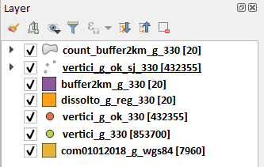
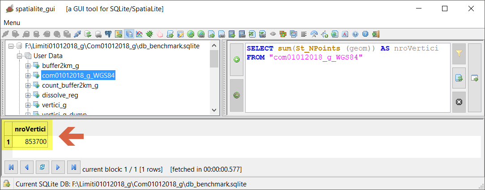
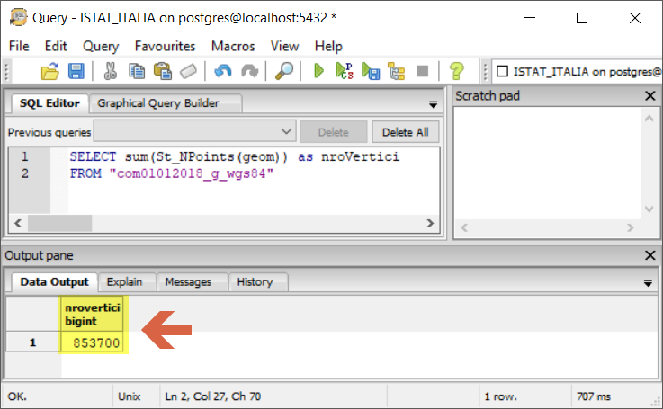
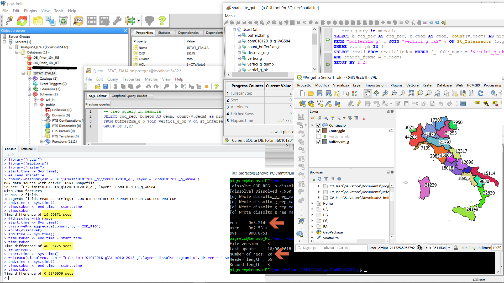
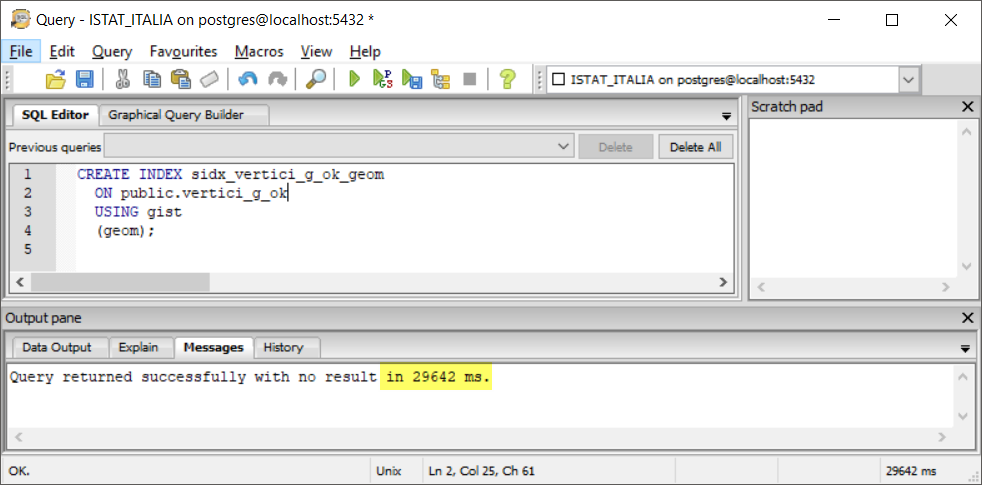
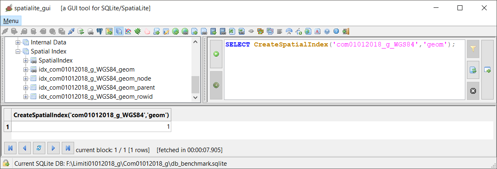

# benchmark
con due laptop e vari software GIS

<!-- TOC -->

- [benchmark](#benchmark)
    - [Laptop Lenovo Z50 - SO windows 10 64 b (LZ50)](#laptop-lenovo-z50---so-windows-10-64-b-lz50)
    - [xxxxxxxxxxxxxxxxx - SO windows 10 64 b (yyy)](#xxxxxxxxxxxxxxxxx---so-windows-10-64-b-yyy)
    - [dataset](#dataset)
    - [software GIS](#software-gis)
    - [prove](#prove)
    - [come eseguire le prove](#come-eseguire-le-prove)
    - [Quadro sinottico prove](#quadro-sinottico-prove)
    - [Osservazioni finali](#osservazioni-finali)
    - [Ringraziamenti](#ringraziamenti)

<!-- /TOC -->

## Laptop Lenovo Z50 - SO windows 10 64 b (LZ50)

sistema:

* _processore_: AMD FX-7500 Radeon R7, 10 Compute Cores 4C + 6G 2,10 GHz
* _RAM_: 8,00 GB
* _Tipo sistema_: Sistema operativo a 64 bit, processore basato du x64
* _storage_: HDD 

## xxxxxxxxxxxxxxxxx - SO windows 10 64 b (yyy)

sistema:

* _processore_: Intel i7-7700 2,10 GHz
* _RAM_: 16,00 GB
* _Tipo sistema_: Sistema operativo a 64 bit, processore basato du x64
* _storage_: SSD

## dataset

Confini delle unità amministrative a fini statistici al 1 gennaio 2018 -ISTAT - (anno 2018 - [versione generalizzata](https://www4.istat.it/it/archivio/209722)) cartella Com01012018_g. NB: gli shapefile dell'ISTAT hanno geometrie non valide, la correzione è stata fatta tramite spatialite_gui - leggere blog post su [pigrecoinfinito](https://pigrecoinfinito.wordpress.com/2018/03/23/gli-shapefile-istat-del-2018-non-sono-validi-ecco-come-correggerli-con-spatialite/)

* [qui](./dati/com01012018_g_WGS84.7z) shapefile
* [qui](./dati/db_benchmark.7z) db sqlite

Comuni ISTAT     |nro vertici|senza duplicati | nro duplicati
-----------------|-----------|----------------|--------------
7960 MultiPolygon|853.700    |432.355         |421.345







--> [torna su](#benchmark)

## software GIS

* [QGIS](https://qgis.org/it/site/) 2.18.24, 3.2.3, 3.3 master (05/10/2018)
* [R](https://www.r-project.org/) 3.5.1 + [RStudio](https://www.rstudio.com/products/rstudio/download/) 1.1.456 (nella console: install.packages("rgdal") e poi install.packages("GISTools") )
* SpatiaLite_gui [2.10](http://www.gaia-gis.it/gaia-sins/windows-bin-NEXTGEN-amd64/)
* [PostgreSQL](https://www.postgresql.org/) 9.3/PostGIS 2.2.3
* [Mapshaper](https://mapshaper.org/) 0.4.94 (riga di comando - GNU/Linux - Ubuntu 16.4 in Win10 64b)

```
sudo npm install -g mapshapersudo apt-get update
sudo apt-get install nodejs
sudo apt-get install npm
sudo npm install -g mapshaper
```



## prove

1. [estrai vertici](./prove/estrai_vertici.md);
2. [elimina geometrie duplicate](./prove/elimina_geom_duplicate.md) (alludo ai vertici);
3. [dissolvi per regione](./prove/dissolvi_regione.md) (campo "cod_reg");
4. [buffer -2 km](./prove/buffer2km.md) (su dissolvi per regione);
5. [conta punti nel poligono](./prove/conta_punti_poligono.md);
6. [spatial join](./prove/spatial_join.md) (tra vertici e regione - trasferire campo "cod_reg");

**Descrizione:** il dataset rappresenta un insieme di (#7.960) poligoni (Comuni italiani ISTAT **generalizzati**) da cui estrarre i vertici (#853.700): questi, in corrispondenza dei limiti adiacenti tra i Comuni, saranno duplicati e quindi con la _seconda prova_ si eliminano queste geometrie (#432.355); la _terza prova_ richiede di dissolvere, il dataset di partenza, usando il campo "cod_reg" ottenendo i limiti regionali ISTAT **generalizzati** (#20); la _quarta prova_ richiede un semplice buffer, negativo, di 2 km sul dataset risultante dal dissolve; la _quinta prova_ conteggia il numero di punti per ogni regione con buffer -2 km; infine, _ultima prova_, trasferire il campo "cod_reg" nel vettore vertici senza duplicati. (Il dataset e le prove sono state studiate per essere facilmente realizzate nel mio laptop LZ50)

--> [torna su](#benchmark)

## come eseguire le prove

È importante (per PC/Laptop datati, come il mio) chiudere tutti gli applicativi non interessati alla prova in modo che ogni risorsa sia disponibile per i test; inoltre, la prova va _ripetuta due volte_ e il tempo impiegato espresso in secondi. L'output va sempre salvato in un file (shp, csv) o tabella (in caso di DBMS).

Per i DBMS **SpatiaLite** e **PostGIS** - creazione indici spaziali





--> [torna su](#benchmark)

## [Quadro sinottico prove](./quadro_sinottico.md)

## Osservazioni finali

Grazie a questi test è stato possibile `'aprire'` quattro ticket (segnalazioni) sul [bugtracker di QGIS](https://issues.qgis.org/projects/qgis/issues/), le quattro segnalazioni sono state risolte e la prossima **QGIS 3.4** sarà più performante (Grazie [Nyall](https://twitter.com/nyalldawson?lang=it) e [Alessandro](https://twitter.com/elpaso66?lang=it)).

1. [prima segnalazione](https://issues.qgis.org/issues/19919)
2. [seconda segnalazione](https://issues.qgis.org/issues/19973)
3. [terza segnalazione](https://issues.qgis.org/issues/19971)
4. [quarta segnalazione](https://issues.qgis.org/issues/20015)

--> [torna su](#benchmark)

## Ringraziamenti

- [Ludovico Frate](https://twitter.com/FrateLudovico?lang=it) per l'idea e gli script per R + RStudio;
- [Andrea Borruso](https://twitter.com/aborruso?lang=it) per avermi fatto conoscere _mapshaper_ e consigliato i relativi script