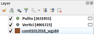
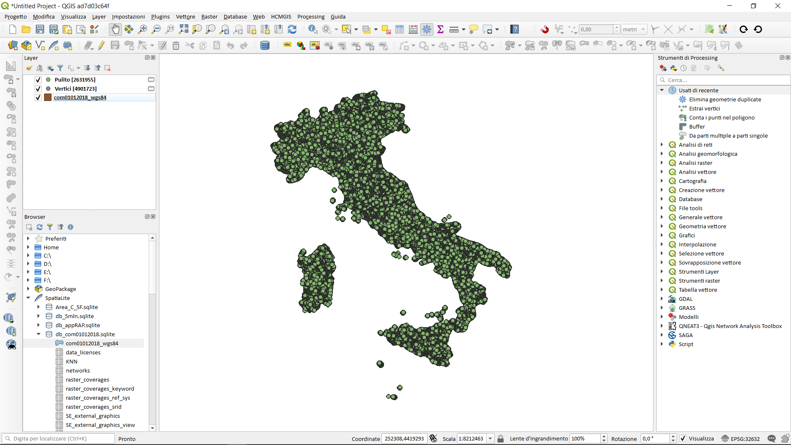

# benchmark
benchmark:due laptop e  vari software GIS

<!-- TOC -->

- [benchmark](#benchmark)
    - [Laptop Lenovo Z50 - SO windows 10 64 b (LZ50)](#laptop-lenovo-z50---so-windows-10-64-b-lz50)
    - [xxxxxxxxxxxxxxxxx - SO windows 10 64 b (yyy)](#xxxxxxxxxxxxxxxxx---so-windows-10-64-b-yyy)
    - [dataset](#dataset)
    - [software GIS](#software-gis)
    - [prove](#prove)
    - [come eseguire le prove](#come-eseguire-le-prove)

<!-- /TOC -->

## Laptop Lenovo Z50 - SO windows 10 64 b (LZ50)

sistema:

* _processore_: AMD FX-7500 Radeon R7, 10 Compute Cores 4C + 6G 2,10 GHz
* _RAM_: 8,00 GB
* _Tipo sistema_: Sistema operativo a 64 bit, processore basato du x64
* _storage_: HDD 


## xxxxxxxxxxxxxxxxx - SO windows 10 64 b (yyy)

sistema:

* _processore_: Intel i7-7700 2,10 GHz
* _RAM_: 16,00 GB
* _Tipo sistema_: Sistema operativo a 64 bit, processore basato du x64
* _storage_: SSD

## dataset

Confini delle unità amministrative a fini statistici al 1 gennaio 2018 -ISTAT - (anno 2018 - [versione non generalizzata](https://www4.istat.it/it/archivio/209722)) cartella Com01012018. NB: gli shapefile dell'ISTAT hanno geometrie non valide, la correzione è stata fatta tramite spatialite_gui - leggere blog post su [pigrecoinfinito](https://pigrecoinfinito.wordpress.com/2018/03/23/gli-shapefile-istat-del-2018-non-sono-validi-ecco-come-correggerli-con-spatialite/)

* [qui](https://mega.nz/#!BApjSCJT!kSPF01S_BPEpK_ErYEx1Jse4XWjV52oA0iS0dgxZU5o) shapefile
* [qui](https://mega.nz/#!gFglWIAC!CmDUmG4FTbEwpd7KixGmf7Zhw7kALru_2eQfzSJpL9c) db sqlite

comuni ISTAT |nro vertici|nro no duplicati| nro duplicati
-------------|-----------|----------------|--------------
7960 MultiPolygon|4.901.723|2.631.955|2.269.768

Da QGIS:



## software GIS

* [QGIS](https://qgis.org/it/site/) 2.18.24, 3.2.3, 3.3 master
* [R](https://www.r-project.org/) 3.5.1 + [RStudio](https://www.rstudio.com/products/rstudio/download/) 1.1.456 (nella console: install.packages("rgdal") e poi install.packages("GISTools") )
* SpatiaLite_gui [2.10](http://www.gaia-gis.it/gaia-sins/windows-bin-NEXTGEN-amd64/)
* [PostgreSQL](https://www.postgresql.org/) 9.3/PostGIS 2.2.3
* [Mapshaper](https://mapshaper.org/) 0.4.94 (riga di comando - GNU/Linux - Ubuntu 16.4 in Win10 64b)

```
sudo npm install -g mapshapersudo apt-get update
sudo apt-get install nodejs
sudo apt-get install npm
sudo npm install -g mapshaper
```

## prove

1. [estrai vertici](./prove/estrai_vertici.md);
2. [elimina geometrie duplicate](./prove/elimina_geom_duplicate.md) (alludo ai vertici)
3. [dissolvi per regione](./prove/dissolvi_regione.md);
4. [buffer 1 m](./prove/buffer1m.md) (su dissolvi per regione);
5. [conta punti nel poligono](./prove/conta_punti_poligono.md) (usando il buffer 1 m e vertici, senza duplicati, per comune)
6. [spatial join](./prove/spatial_join.md) (tra vertici e regione - trasferire codice regione)

[Quadro sinottico](./quadro_sinottico.md)

## come eseguire le prove

È importante chiudere tutti gli applicativi non interessati alla prova in modo che ogni risorsa sia dedicata ai test, inoltre, la prova va _ripetuta due volte_ e il valore espresso in secondi.


