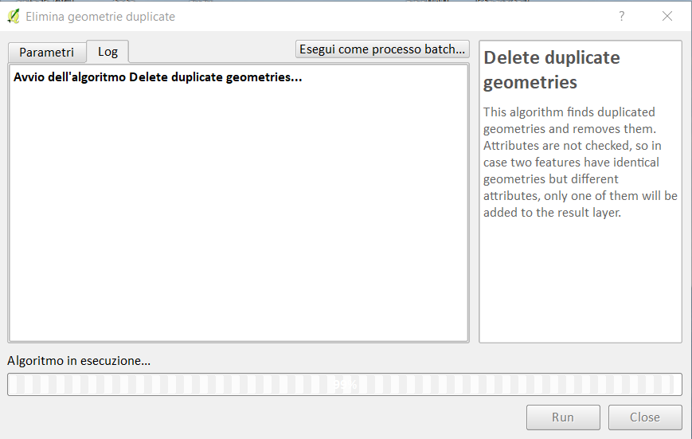
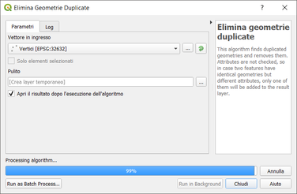
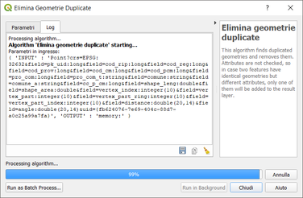
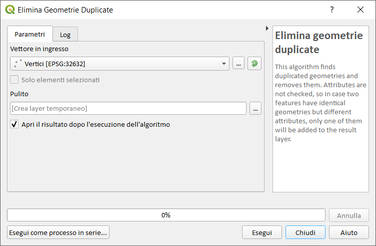
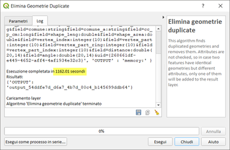
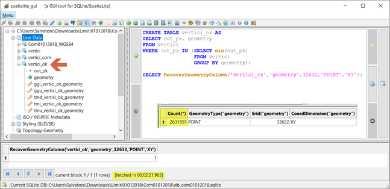
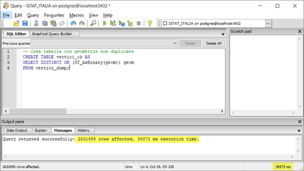
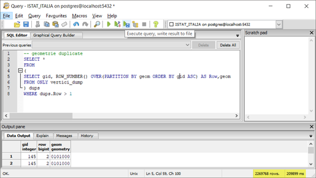

# elimina geometrie duplicate (LZ50)

dataset: db sqlite con spatialidex

## QGIS 2.18.24


**Elimina geometrie duplicate** è un algoritmo inefficiente (problema risolto nella prossima 3.4), nessun risultato dopo oltre 30 minuti, quindi è stato bloccato:



## QGIS 3.2.3




**Elimina geometrie duplicate** è un algoritmo inefficiente (problema risolto nella prossima 3.4), nessun risultato dopo oltre 10 minuti, quindi è stato bloccato:



## QGIS 3.3 master


NB: Il debug rallenta le prestazioni!!!





## SpatiaLite_GUI 2.10

Elimino le geometrie duplicate:


```
-- Creo tabella evitando le geometrie duplicate:
CREATE TABLE vertici_ok as 
SELECT distinct geometry
FROM vertici;
SELECT RecoverGeometryColumn('vertici_ok','geometry',32632,'POINT','XY');
```
NB: il **select distinct** NON è preciso (1e-5)




## PostgreSQL 9.3 / PostGIS 2.2.3 / pgAdmin 3




```
SELECT DISTINCT ON (ST_AsBinary(geom)) geom 
FROM vertici_dump;
```



```
SELECT * 
FROM 
(
SELECT id, ROW_NUMBER() OVER(PARTITION BY geom ORDER BY id ASC) AS Row,geom 
FROM ONLY vertici_dump
) dups 
WHERE dups.Row > 1
```
[articolo.](https://gis4programmers.wordpress.com/2016/10/11/detecting-duplicated-geometries-in-a-postgis-table/)

la seguente restituisce valori diversi, perché?
```
SELECT geom, count(*) as nro
FROM vertici_dump
GROUP BY 1
HAVING count(*) > 1
ORDER BY count(*) DESC;
```

# RISULTATI (LZ50) -elimina geometrie duplicate

tempo [sec]|programma
:---------:|---------
NO|QGIS 2.18.24
NO|QGIS 3.2.3
1162|QGIS 3.3 master con debug
302| SpatiaLite_GUI 2.10 no spatialIndex
179|pgAdmin 3 con spatialIndex
??|mapshaper
??|R + RStudio