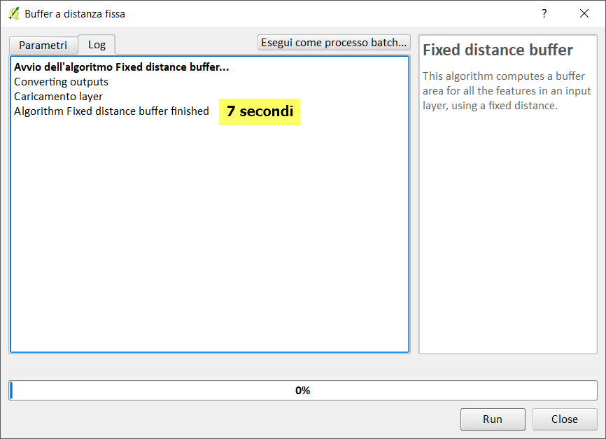
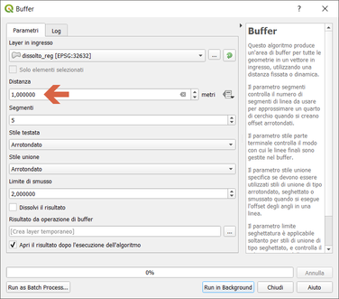
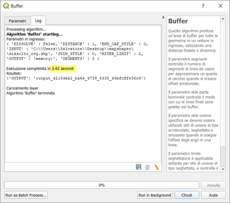
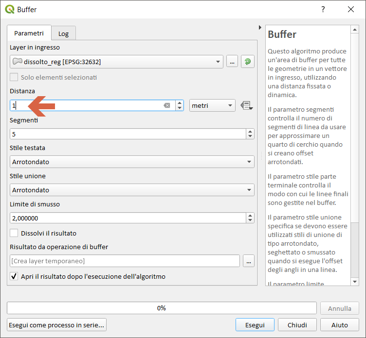
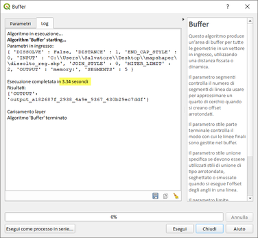
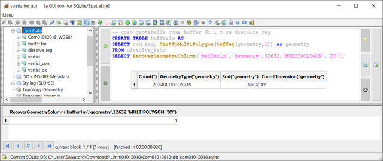
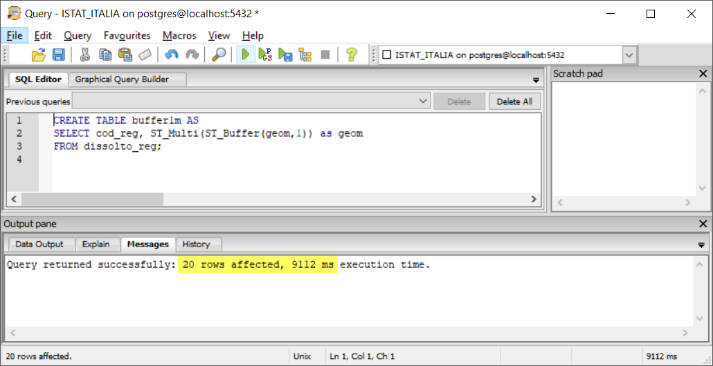
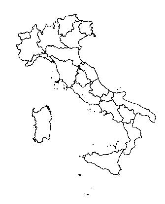

# buffer 1 m (LZ50)

dataset: db sqlite con spatialidex

<!-- TOC -->

- [buffer 1 m (LZ50)](#buffer-1-m-lz50)
    - [QGIS 2.18.24](#qgis-21824)
    - [QGIS 3.2.3](#qgis-323)
    - [QGIS 3.3 master](#qgis-33-master)
    - [SpatiaLite_GUI 2.10](#spatialitegui-210)
    - [PostgreSQL 9.3 / PostGIS 2.2.3 / pgAdmin 3](#postgresql-93--postgis-223--pgadmin-3)
    - [mapshaper](#mapshaper)
    - [R + RStudio](#r--rstudio)
    - [RISULTATI (LZ50) - buffer 1 m](#risultati-lz50---buffer-1-m)

<!-- /TOC -->

## QGIS 2.18.24




## QGIS 3.2.3






## QGIS 3.3 master


NB: Il debug rallenta le prestazioni!!!





## SpatiaLite_GUI 2.10

estraggo i vertici:


```
-- Creo tabella estraendo i vertici
CREATE TABLE "vertici_com" AS
SELECT ST_DissolvePoints(geometry) as geometry from Com01012018_WGS84;
SELECT RecoverGeometryColumn('vertici_com','geometry',32632,'MULTIPOINT','XY');
-- Esplodo i vertici MultiPoint
SELECT ElementaryGeometries( 'vertici_com' ,'geometry' , 'vertici' ,'out_pk' , 'out_multi_id', 1 ) as num, 'vertici' as label;
```


## PostgreSQL 9.3 / PostGIS 2.2.3 / pgAdmin 3


```
-- crea tabella vertici_dump
CREATE TABLE vertici_dump AS
SELECT k.gid, k.geom  
FROM ( SELECT (ST_DumpPoints(geom)).*, gid FROM com01012018_wgs84 )k;
```


## mapshaper

Il Buffer sembra non previsto!!!

## R + RStudio

```
##install required packages
#install.packages("rgeos")
##required packages
library(rgeos)
library(sp)
library(rgdal)


start.time <- Sys.time()
## read shapefile
regioni<-readOGR(dsn = "C:\\Users\\Salvatore\\Desktop\\mapshaper", layer = "dissolve_regioni")
end.time <- Sys.time()
time.taken <- end.time - start.time
time.taken

##Buffer with rgeos AND writeOGR
start.time <- Sys.time()
buffer1m<-gBuffer(regioni, byid = TRUE , width = 1)
plot(buffer1m)
buffer1m<- as(buffer1m,"SpatialPolygonsDataFrame")
writeOGR(buffer1m, dsn = "C:\\Users\\Salvatore\\Desktop\\mapshaper",layer="buffer1mR", driver = "ESRI Shapefile")
end.time <- Sys.time()
time.taken <- end.time - start.time
time.taken
```




## RISULTATI (LZ50) - buffer 1 m

tempo [sec]|programma
:---------:|---------
7|QGIS 2.18.24
3.4|QGIS 3.2.3
3.3|QGIS 3.3 master con debug
9|SpatiaLite_GUI 2.10
9|pgAdmin 3 con spatialIndex
NO|mapshaper
5+15|R + RStudio

[torna su](#buffer-1-m-lz50)