# buffer -2 km (LZ50)

**dataset:** db sqlite con spatialindex tabella _dissolve_reg_

<!-- TOC -->

- [buffer -2 km (LZ50)](#buffer--2-km-lz50)
    - [QGIS 2.18.24](#qgis-21824)
    - [QGIS 3.2.3](#qgis-323)
    - [QGIS 3.3 master](#qgis-33-master)
    - [SpatiaLite GUI 2.10](#spatialite-gui-210)
    - [PostgreSQL 9.3 / PostGIS 2.2.3 / pgAdmin 3](#postgresql-93--postgis-223--pgadmin-3)
    - [mapshaper](#mapshaper)
    - [R + RStudio](#r--rstudio)
    - [RISULTATI (LZ50) - buffer -2 km](#risultati-lz50---buffer--2-km)
    - [Osservazioni finali:](#osservazioni-finali)

<!-- /TOC -->

## QGIS 2.18.24


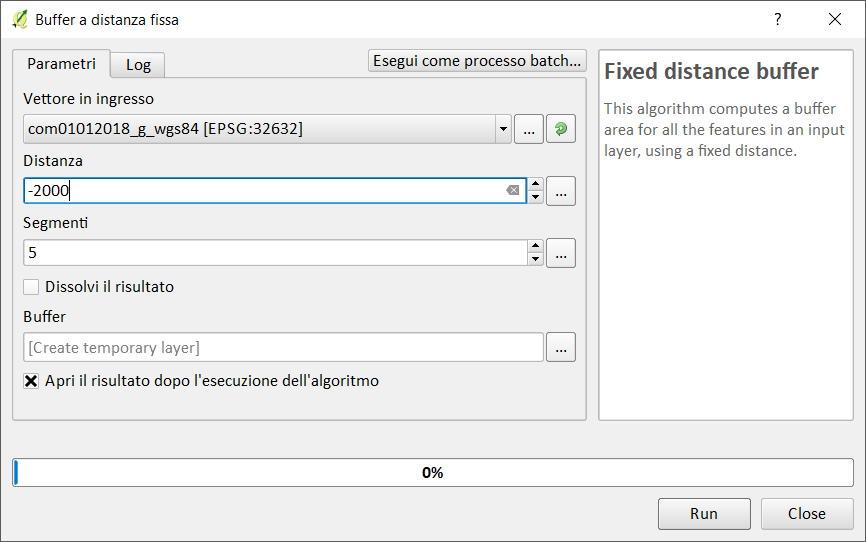

Creando un layer temporaneo in memoria:

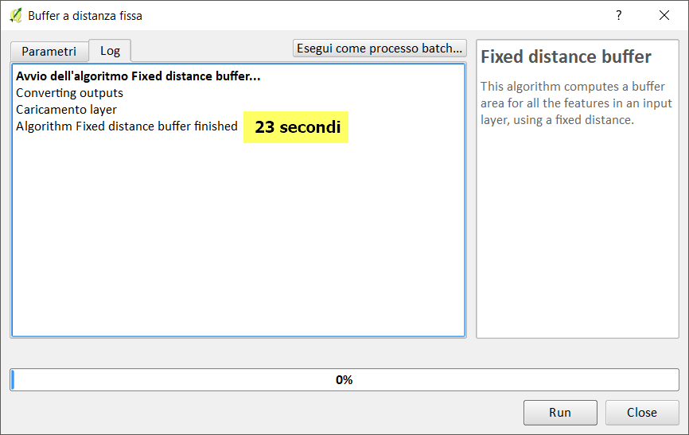

Salvando in un file shp:

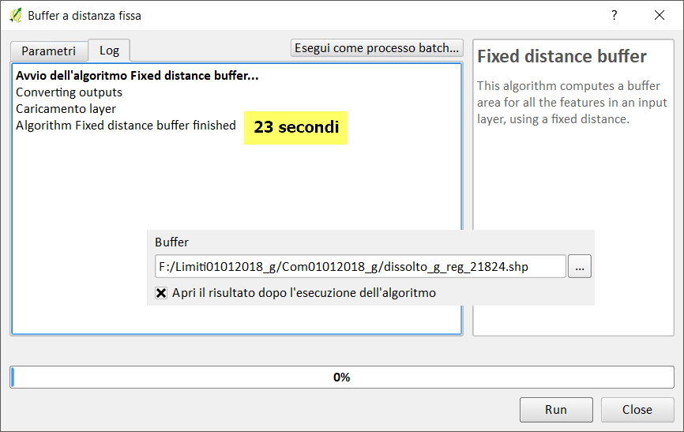

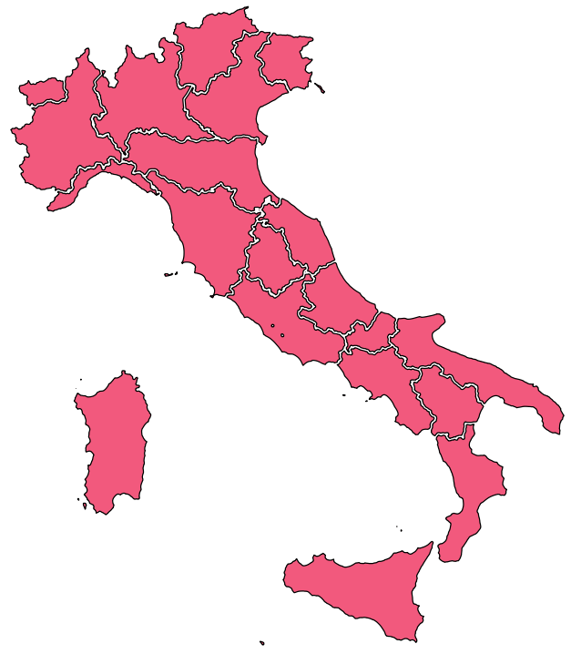

-->[torna su](#dissolvi-per-regione-lz50)

## QGIS 3.2.3


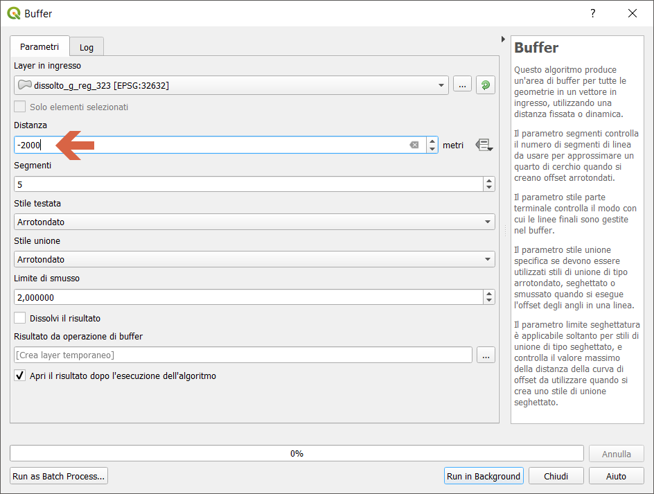

Creando un layer temporaneo in memoria:

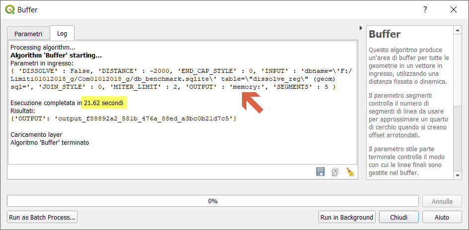

Salvando in un file shp:

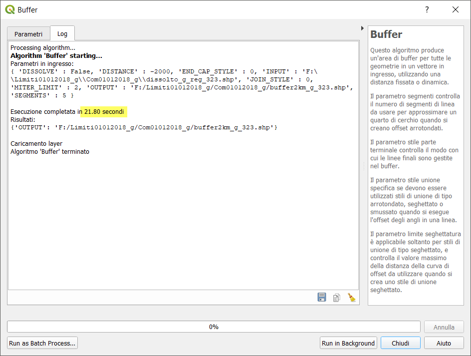

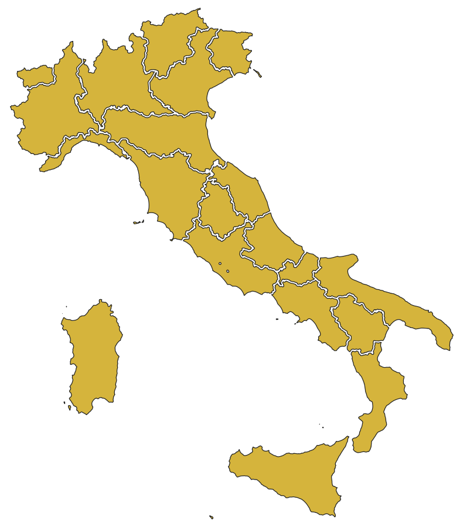

-->[torna su](#dissolvi-per-regione-lz50)

## QGIS 3.3 master


NB: Il debug rallenta le prestazioni!!!

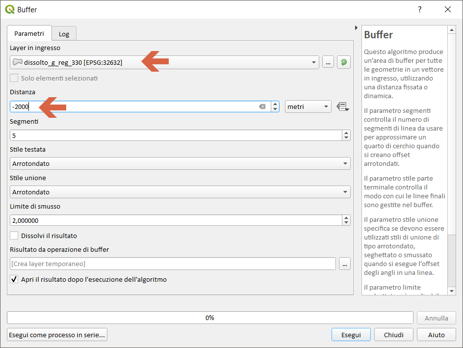

Creando un layer temporaneo in memoria:

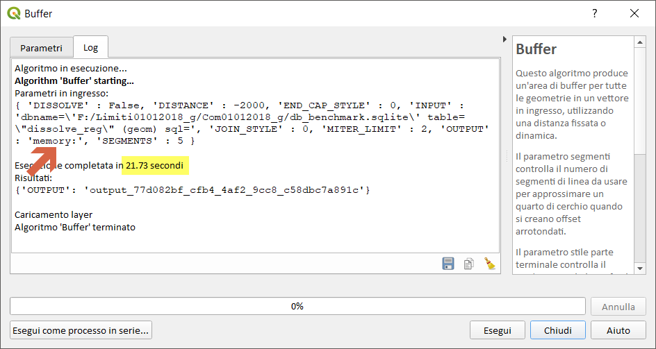

Salvando in un file shp:

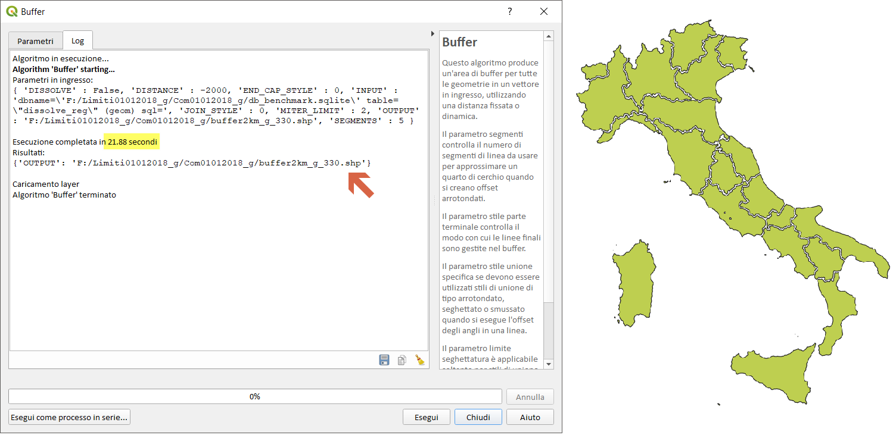

-->[torna su](#dissolvi-per-regione-lz50)

## SpatiaLite GUI 2.10


Creando una tabella:

```
-- creo geotabella buffer di -2 km
CREATE TABLE buffer2km_g AS
SELECT cod_reg, CastToMultiPolygon(ST_Buffer(geom, -2000)) AS geom
FROM dissolve_reg;
SELECT RecoverGeometryColumn('buffer2km_g','geom',32632,'MULTIPOLYGON','XY');
-- creo SpatialIndex SpatiaLite
SELECT CreateSpatialIndex ('buffer2km_g','geom');

```
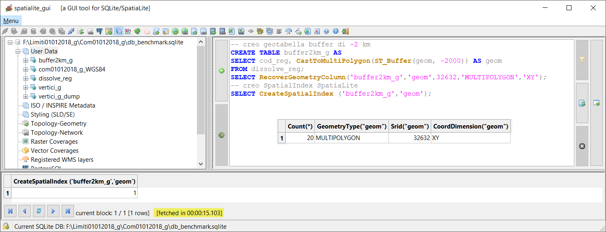

Creando una query in memoria:

```
-- creo query in memoria
SELECT cod_reg, CastToMultiPolygon(ST_Buffer(geom, -2000)) AS geom
FROM dissolve_reg;
```

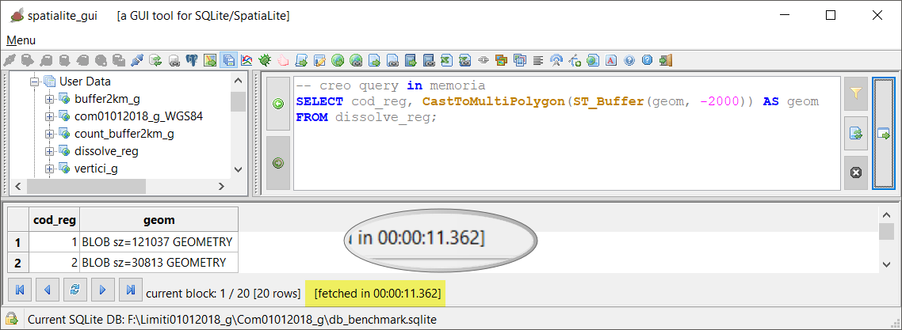

-->[torna su](#dissolvi-per-regione-lz50)

## PostgreSQL 9.3 / PostGIS 2.2.3 / pgAdmin 3


Creo tabella:

```
-- creo geotabella con buffer di -2 km
CREATE TABLE buffer2km_g AS
SELECT cod_reg, St_Multi(St_Buffer(geom, -2000)) AS geom
FROM dissolto_g_reg;
```
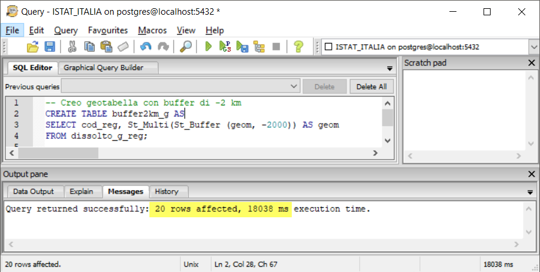

Creo query in memoria:

```
-- creo query in memoria
SELECT cod_reg, St_Multi(St_Buffer(geom, -2000)) AS geom
FROM dissolto_g_reg;
```

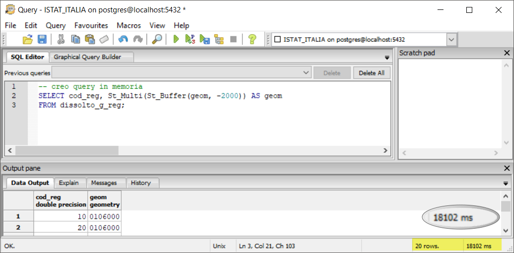

-->[torna su](#dissolvi-per-regione-lz50)

## mapshaper


```
Il Buffer sembra non previsto!!!
```

-->[torna su](#dissolvi-per-regione-lz50)

## R + RStudio


```
library(rgeos)
library(sp)
library(rgdal)

start.time <- Sys.time()
## read shapefile
regioni<-readOGR(dsn = "F:\\Limiti01012018_g\\Com01012018_g", layer = "dissolto_g_reg")
end.time <- Sys.time()
time.taken <- end.time - start.time
time.taken
##Buffer with rgeos AND writeOGR
start.time <- Sys.time()
buffer2km<-gBuffer(regioni, byid = TRUE , width = -2000)
##plot(buffer2km)
buffer2km<- as(buffer2km,"SpatialPolygonsDataFrame")
end.time <- Sys.time()
time.taken <- end.time - start.time
time.taken
start.time <- Sys.time()
writeOGR(buffer2km, dsn = "F:\\Limiti01012018_g\\Com01012018_g",layer="buffer2kmR", driver = "ESRI Shapefile")
end.time <- Sys.time()
time.taken <- end.time - start.time
time.taken
```
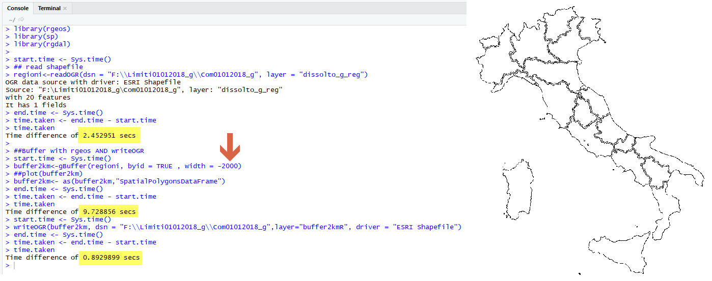

## RISULTATI (LZ50) - buffer -2 km

file/table [sec]|memoria [sec]|software GIS
:---------:|:---------:|---------
23         |   23      |QGIS 2.18.24
22         |   22      |QGIS 3.2.3
22         |   22      |QGIS 3.3 master con debug
15         |   11      |SpatiaLite_GUI 2.10
18         |   18      |pgAdmin 3 con spatialIndex
 `-`       |   `-`     |mapshaper
13         |   12      |R + RStudio

`-` prova non possibile! 

[torna su](#dissolvi-per-regione-lz50)

## Osservazioni finali:

In QGIS l'uso dei _file temporanei_ (in memoria) velocizza di parecchio la generazione dell'output di alcuni processing, in questo caso sembra non cambiare nulla anche per PostGIS,Spatialite e RStudio.