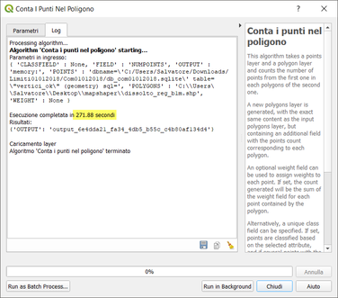
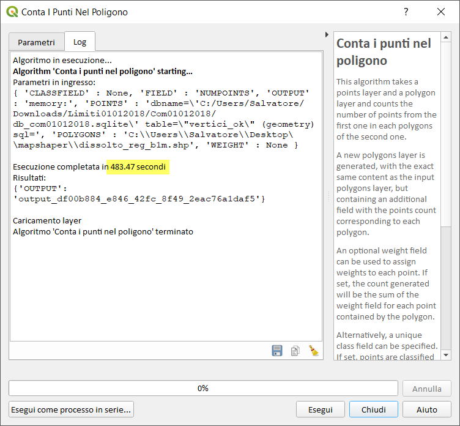
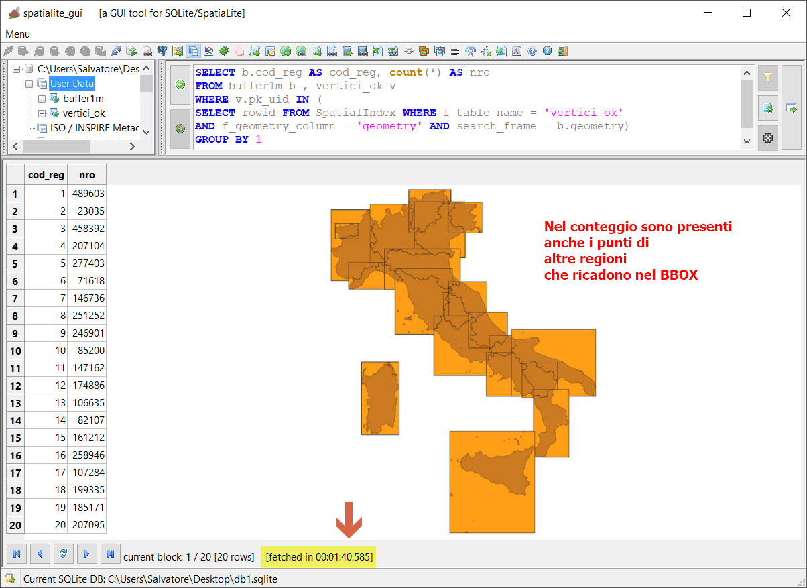

# conta punti nel poligono (LZ50)

dataset: db sqlite con spatialidex

<!-- TOC -->

- [conta punti nel poligono (LZ50)](#conta-punti-nel-poligono-lz50)
    - [QGIS 2.18.24](#qgis-21824)
    - [QGIS 3.2.3](#qgis-323)
    - [QGIS 3.3 master](#qgis-33-master)
    - [SpatiaLite_GUI 2.10](#spatialitegui-210)
    - [PostgreSQL 9.3 / PostGIS 2.2.3 / pgAdmin 3](#postgresql-93--postgis-223--pgadmin-3)
    - [mapshaper](#mapshaper)
    - [RISULTATI (LZ50) - conta punti nel poligono](#risultati-lz50---conta-punti-nel-poligono)

<!-- /TOC -->

## QGIS 2.18.24


## QGIS 3.2.3




## QGIS 3.3 master


NB: Il debug rallenta le prestazioni!!!




## SpatiaLite_GUI 2.10

estraggo i vertici:


```
-- Creo tabella estraendo i vertici
CREATE TABLE "vertici_com" AS
SELECT ST_DissolvePoints(geometry) as geometry from Com01012018_WGS84;
SELECT RecoverGeometryColumn('vertici_com','geometry',32632,'MULTIPOINT','XY');
-- Esplodo i vertici MultiPoint
SELECT ElementaryGeometries( 'vertici_com' ,'geometry' , 'vertici' ,'out_pk' , 'out_multi_id', 1 ) as num, 'vertici' as label;
```


## PostgreSQL 9.3 / PostGIS 2.2.3 / pgAdmin 3


```
-- crea tabella vertici_dump
CREATE TABLE vertici_dump AS
SELECT k.gid, k.geom  
FROM ( SELECT (ST_DumpPoints(geom)).*, gid FROM com01012018_wgs84 )k;
```


## mapshaper

```
time node  --max-old-space-size=4192 `which mapshaper` encoding=utf-8 dissolto_reg_b1m.shp -join vertix.shp calc='join_count = count()' fields= -o out_count_reg.shp
```


## RISULTATI (LZ50) - conta punti nel poligono

tempo [sec]|programma
:---------:|---------
214|QGIS 2.18.24
272|QGIS 3.2.3
182|QGIS 3.3 master con debug
??|SpatiaLite_GUI 2.10
??|pgAdmin 3 con spatialIndex
303|mapshaper
??|R + RStudio
