# conta i punti nel poligono (LZ50)

**dataset:** db sqlite con spatialindex tabella _vertici_g_ok_ e _buffer2km_g_

<!-- TOC -->

- [conta i punti nel poligono (LZ50)](#conta-i-punti-nel-poligono-lz50)
    - [QGIS 2.18.24](#qgis-21824)
    - [QGIS 3.2.3](#qgis-323)
    - [QGIS 3.3 master](#qgis-33-master)
    - [SpatiaLite GUI 2.10](#spatialite-gui-210)
    - [PostgreSQL 9.3 / PostGIS 2.2.3 / pgAdmin 3](#postgresql-93--postgis-223--pgadmin-3)
    - [mapshaper](#mapshaper)
    - [R + RStudio](#r--rstudio)
            - [calcolo conteggio](#calcolo-conteggio)
    - [RISULTATI (LZ50) - conta punti nel poligono](#risultati-lz50---conta-punti-nel-poligono)
    - [Osservazioni finali:](#osservazioni-finali)

<!-- /TOC -->

## QGIS 2.18.24


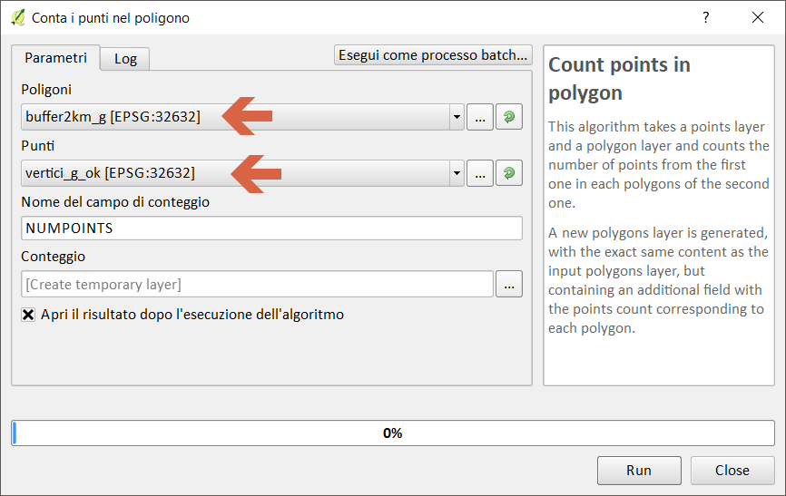

Creando un layer temporaneo in memoria:

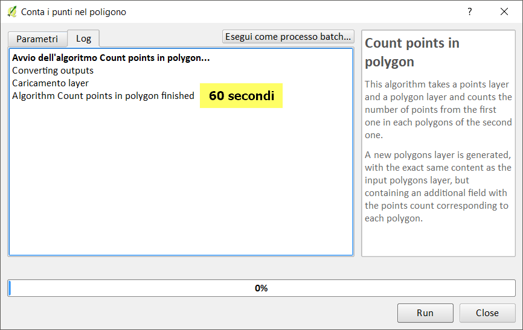

Salvando in un file shp:

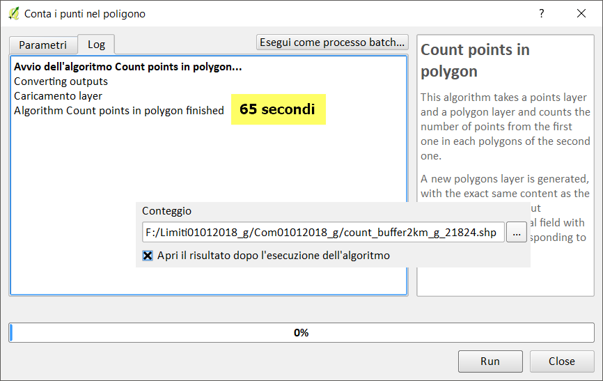

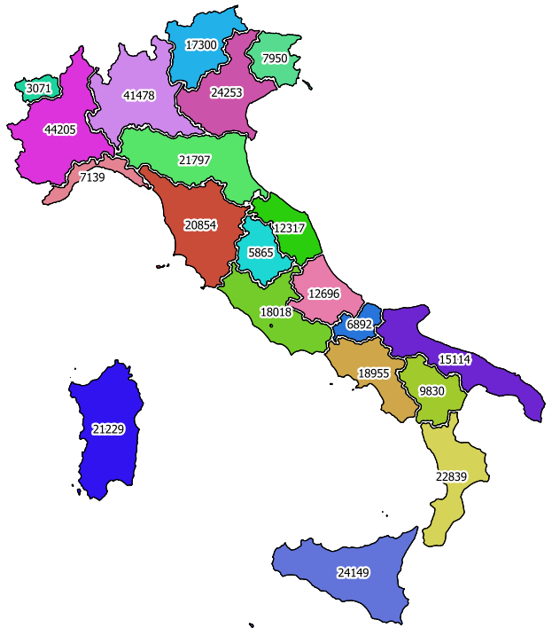

-->[torna su](#conta-i-punti-nel-poligono-lz50)

## QGIS 3.2.3


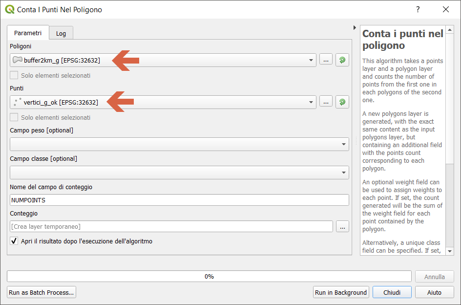

Creando un layer temporaneo in memoria:

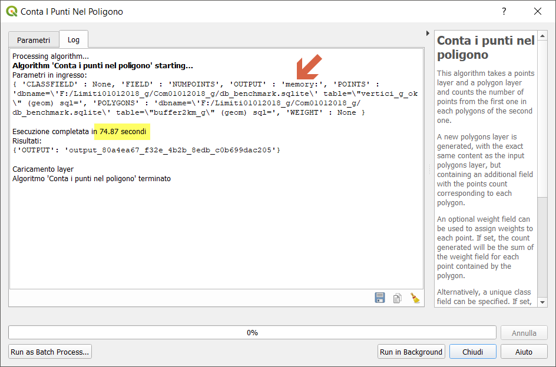

Salvando in un file shp:


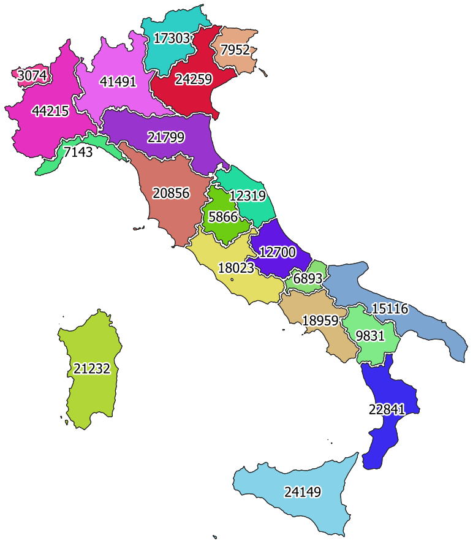

-->[torna su](#conta-i-punti-nel-poligono-lz50)

## QGIS 3.3 master


NB: Il debug rallenta le prestazioni!!!

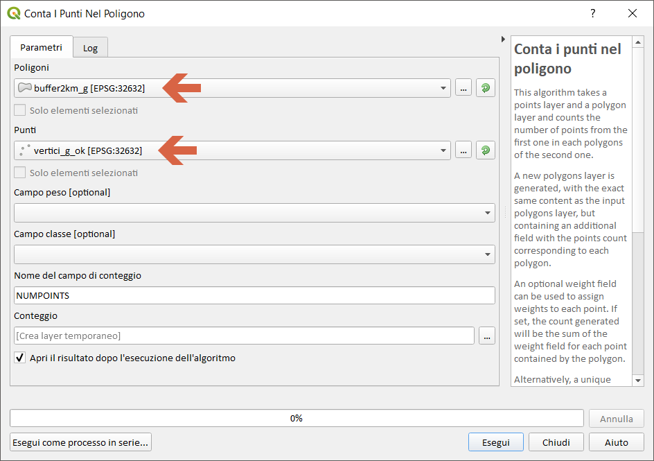

Creando un layer temporaneo in memoria:

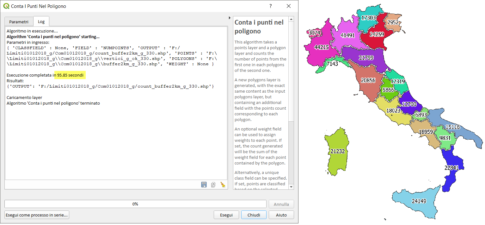

Salvando in un file shp:

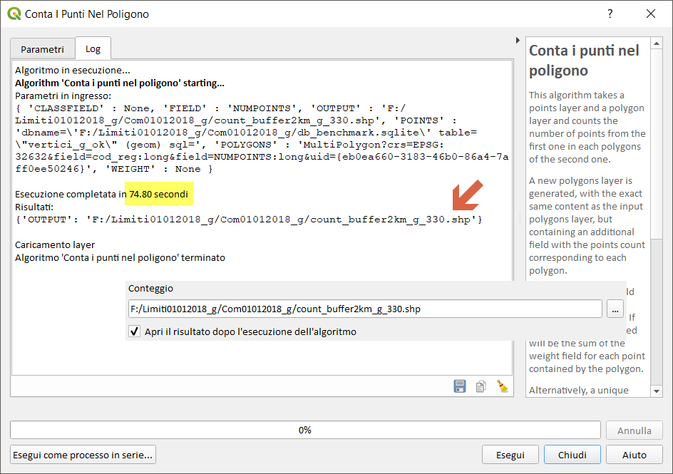

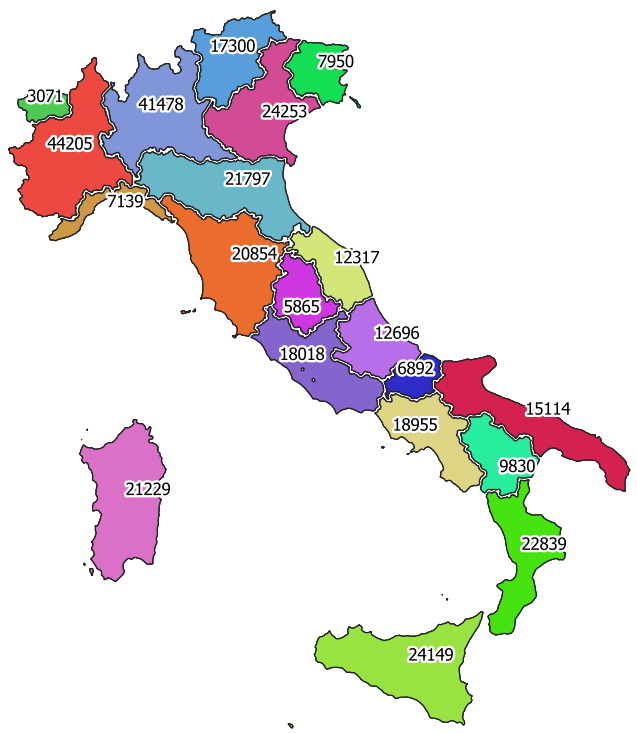

-->[torna su](#conta-i-punti-nel-poligono-lz50)

## SpatiaLite GUI 2.10


Creando una tabella:

```
-- creo geotabella per conteggio punti nei poligoni
CREATE TABLE "count_buffer2km_g" AS
SELECT b.cod_reg AS cod_reg, b.geom AS geom, count(v.geom) AS nro
FROM "buffer2km_g" b JOIN "vertici_g_ok2" v ON St_Intersects (b.geom, v.geom)
WHERE v.out_pk IN (
SELECT rowid FROM SpatialIndex WHERE f_table_name = 'vertici_g_ok2'
AND search_frame = b.geom)
GROUP BY 1,2;
SELECT RecoverGeometryColumn('count_buffer2km_g','geom',32632,'MULTIPOLYGON','XY');


```
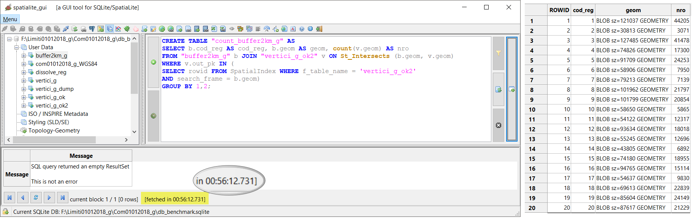

Creando una query in memoria:

```
-- creo query in memoria
SELECT b.cod_reg AS cod_reg, b.geom AS geom, count(v.geom) AS nro
FROM "buffer2km_g" b JOIN "vertici_g_ok2" v ON St_Intersects (b.geom, v.geom)
WHERE v.out_pk IN (
SELECT rowid FROM SpatialIndex WHERE f_table_name = 'vertici_g_ok2'
AND search_frame = b.geom)
GROUP BY 1,2;
```

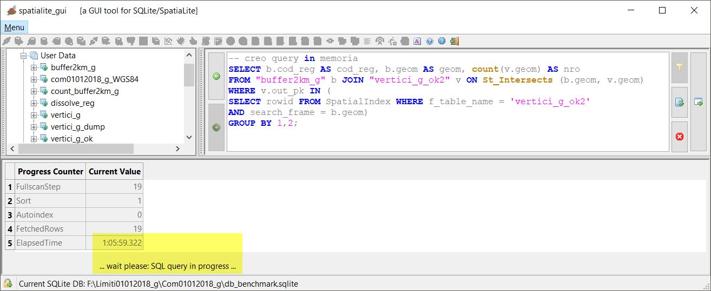

-->[torna su](#conta-i-punti-nel-poligono-lz50)

## PostgreSQL 9.3 / PostGIS 2.2.3 / pgAdmin 3


Creo tabella:

```
-- creo geotabella con conteggio
CREATE TABLE count_buffer2km_g AS
SELECT cod_reg, b.geom AS geom, count(v.geom) as nro
FROM buffer2km_g b join vertici_g_ok v on st_intersects(b.geom,v.geom)
GROUP BY 1,2;
```
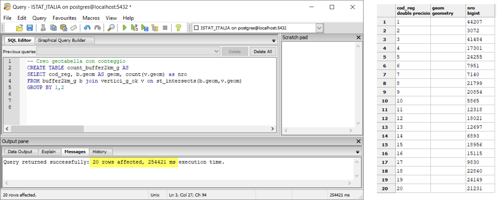

Creo query in memoria:

```
-- creo query in memoria
SELECT cod_reg, b.geom AS geom, count(v.geom) as nro
FROM buffer2km_g b join vertici_g_ok v on st_intersects(b.geom,v.geom)
GROUP BY 1,2;
```

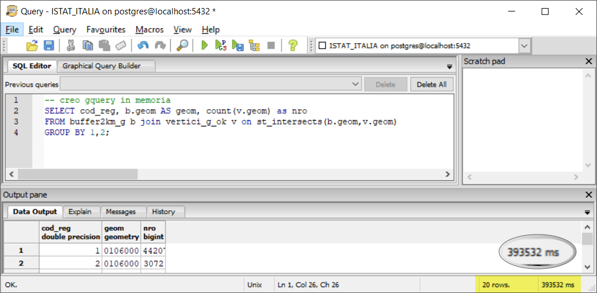

-->[torna su](#conta-i-punti-nel-poligono-lz50)

## mapshaper


```
time node  --max-old-space-size=4192 `which mapshaper` encoding=win1252 buffer2km_g_330.shp -join vertici_g_ok_330.shp calc='join_count = count()' fields= -o count_buffer2km_g_mapsh.shp
```

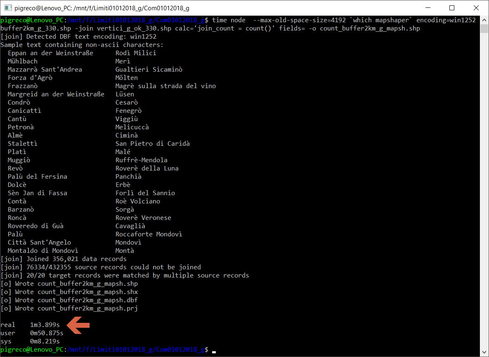

**NB:** i conteggi sono diversi rispetto agli altri software!!!

-->[torna su](#conta-i-punti-nel-poligono-lz50)

## R + RStudio


```
library(rgdal)
library(GISTools)
setwd("F:\\Limiti01012018_g\\Com01012018_g")
start.time <- Sys.time()
punti<-readOGR("vertici_g_ok_330.shp")
reticolo<-readOGR("dissolto_g_reg_330.shp")
end.time <- Sys.time()
time.taken <- end.time - start.time
time.taken
#### calcolo conteggio 
start.time <- Sys.time()
conteggio<-poly.counts(punti, reticolo)
end.time <- Sys.time()
time.taken <- end.time - start.time
time.taken
conteggio
```
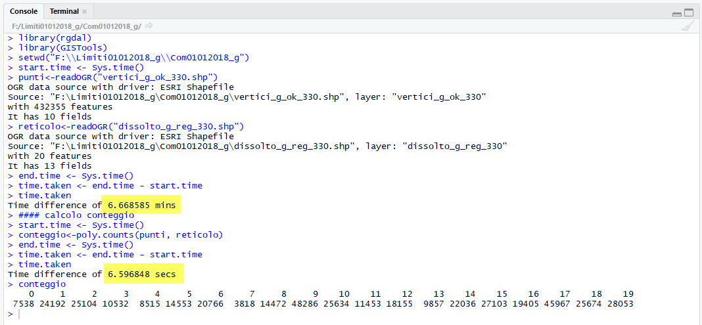

## RISULTATI (LZ50) - conta punti nel poligono

file/table [sec]|memoria [sec]|software GIS
:---------:|:---------:|---------
65         |   60      |QGIS 2.18.24
75         |   75      |QGIS 3.2.3
75         |   75      |QGIS 3.3 master con debug
3372       | +3600     |SpatiaLite_GUI 2.10
254        |   394     |pgAdmin 3 con spatialIndex
64         |   `-`     |mapshaper
407        |   407     |R + RStudio

`-` prova non possibile! 

[torna su](#conta-i-punti-nel-poligono-lz50)

## Osservazioni finali:

In QGIS l'uso dei _file temporanei_ (in memoria) velocizza di parecchio la generazione dell'output di alcuni processing.