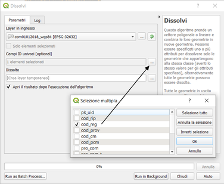
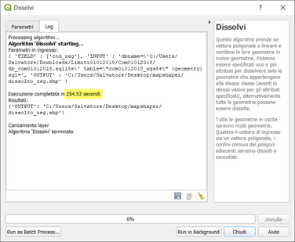
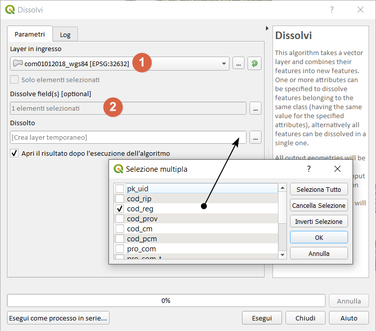
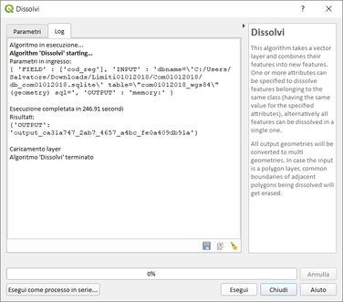
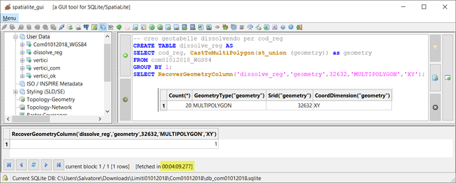
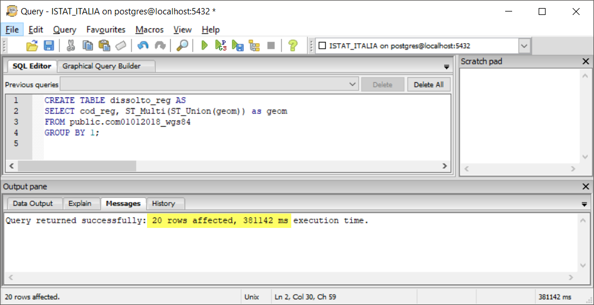
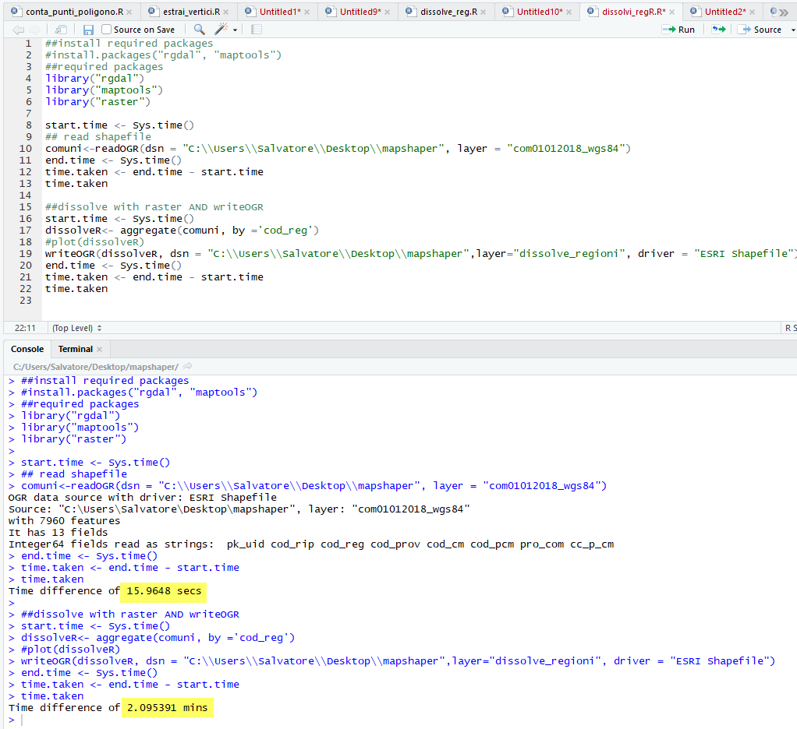
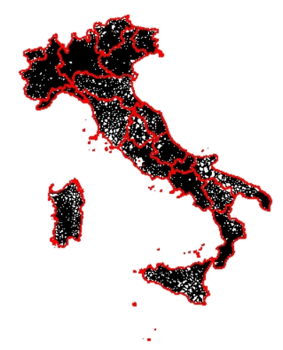

# dissolvi per regione (LZ50)

dataset: db sqlite con spatialidex

<!-- TOC -->

- [dissolvi per regione (LZ50)](#dissolvi-per-regione-lz50)
    - [QGIS 2.18.24](#qgis-21824)
    - [QGIS 3.2.3](#qgis-323)
    - [QGIS 3.3 master](#qgis-33-master)
    - [SpatiaLite_GUI 2.10](#spatialitegui-210)
    - [PostgreSQL 9.3 / PostGIS 2.2.3 / pgAdmin 3](#postgresql-93--postgis-223--pgadmin-3)
    - [mapshaper](#mapshaper)
    - [R +RStudio](#r-rstudio)
    - [RISULTATI (LZ50) - dissolvi per regione](#risultati-lz50---dissolvi-per-regione)

<!-- /TOC -->

## QGIS 2.18.24


## QGIS 3.2.3






## QGIS 3.3 master


NB: Il debug rallenta le prestazioni!!!





## SpatiaLite_GUI 2.10

estraggo i vertici:


```
-- crea geotabella dissolvendo per cod_reg
CREATE TABLE dissolve_reg AS
SELECT cod_reg, CastToMultiPolygon(ST_Union(geometry)) AS geometry 
FROM com01012018_wgs84;
SELECT RecoverGeometryColumn('dissolve_reg','geometry',32632,'MULTIPOLYGON','XY');
```


## PostgreSQL 9.3 / PostGIS 2.2.3 / pgAdmin 3


```
-- crea tabella dissolvi per regione
CREATE TABLE dissolto_reg AS
SELECT cod_reg, ST_Multi(ST_Union(geom)) AS geom  
FROM public.com01012018_wgs84;
```


## mapshaper 

```
time mapshaper encoding=utf-8  com01012018_wgs84.shp -dissolve cod_reg -o outdissolto_reg.shp
```


## R +RStudio

```
# Required packages
libs <- c("rgdal", "maptools")
lapply(libs, require, character.only = TRUE)
start.time <- Sys.time()
# Import comuni data
comuni <- readOGR(dsn = "C:\\Users\\Salvatore\\Desktop\\mapshaper", layer = "com01012018_wgs84")
# Convert SpatialPolygons to data frame
comuni.df <- as(comuni, "data.frame")
end.time <- Sys.time()
time.taken <- end.time - start.time
time.taken
start.time <- Sys.time()
# Dissolve polygons by cod_reg
comuni.union <- unionSpatialPolygons(comuni, comuni.df[, 3])
end.time <- Sys.time()
time.taken <- end.time - start.time
time.taken
start.time <- Sys.time()
#comuni.df.dis <- as(comuni.union, "data.frame") da errore
#comuni.shp <- SpatialPolygonsDataFrame(comuni.union, comuni.df.diss) da errore
# Plotting
plot(comuni)
plot(comuni.union, add = TRUE, border = "red", lwd = 2)
```





## RISULTATI (LZ50) - dissolvi per regione

tempo [sec]|programma
:---------:|---------
588|QGIS 2.18.24
253|QGIS 3.2.3
247|QGIS 3.3 master con debug
249|SpatiaLite_GUI 2.10
381|pgAdmin 3 con spatialIndex
9|mapshaper
18+120|R + RStudio

