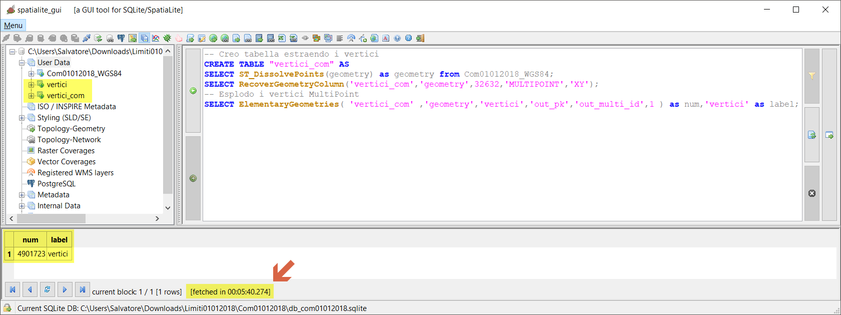
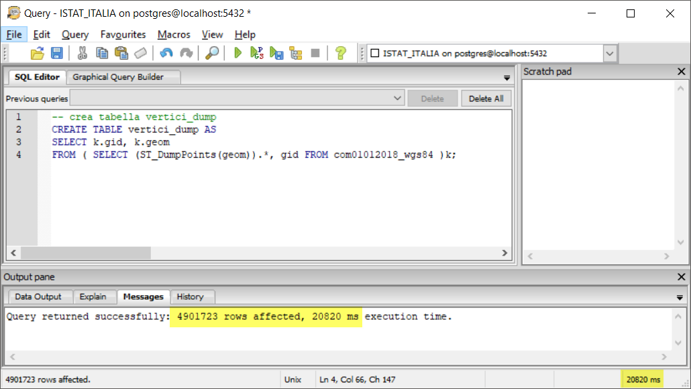

# estrai vertici (LZ50)

dataset: db sqlite con spatialidex

## QGIS 2.18.24


## QGIS 3.2.3


## QGIS 3.3 master


NB: Il debug rallenta le prestazioni!!!


## SpatiaLite_GUI 2.10

estraggo i vertici:


```
-- Creo tabella estraendo i vertici
CREATE TABLE "vertici_com" AS
SELECT ST_DissolvePoints(geometry) as geometry from Com01012018_WGS84;
SELECT RecoverGeometryColumn('vertici_com','geometry',32632,'MULTIPOINT','XY');
-- Esplodo i vertici MultiPoint
SELECT ElementaryGeometries( 'vertici_com' ,'geometry' , 'vertici' ,'out_pk' , 'out_multi_id', 1 ) as num, 'vertici' as label;
```


## PostgreSQL 9.3 / PostGIS 2.2.3 / pgAdmin 3


```
CREATE TABLE vertici_dump AS
SELECT k."PK_UID", k.geom  
FROM ( SELECT (ST_DumpPoints(geom)).*, "PK_UID" FROM comuni )k;
```


# RISULTATI (LZ50) - estrai vertici

tempo [sec]|programma
:---------:|---------
123|QGIS 2.18.24
66|QGIS 3.2.3
95|QGIS 3.3 master con debug
340|SpatiaLite_GUI 2.10 no spatialIndex
20|pgAdmin 3 con spatialIndex
??|mapshaper
??|R + RStudio

Dati:

nro vertici|nro no duplicati| nro duplicati
-----------|----------------|--------------
4.901.723|2.631.955|2.269.768

Da QGIS:

