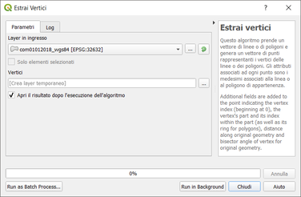
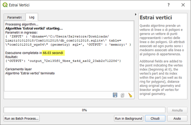
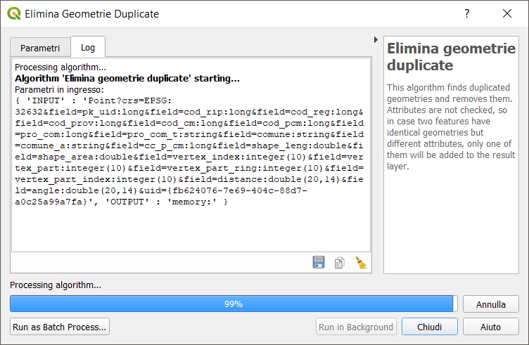
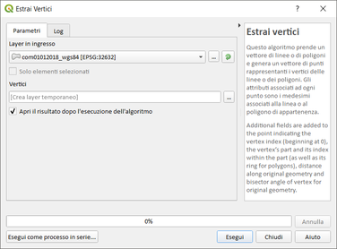
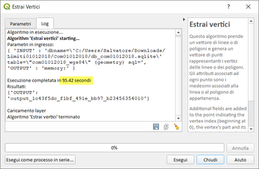
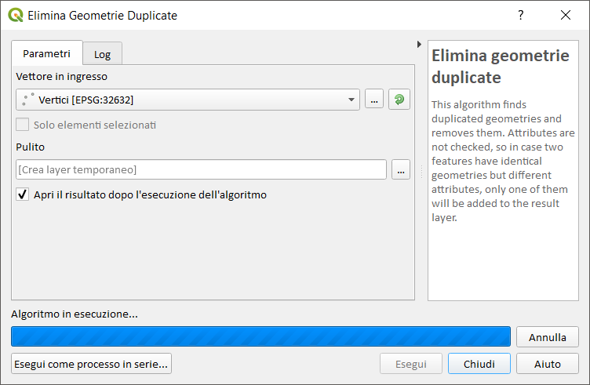
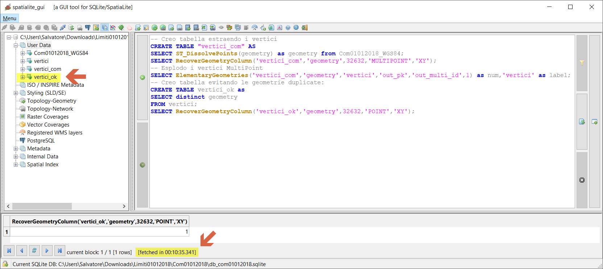

# estrai vertici

dataset: db sqlite con spatialidex

## QGIS 2.18.24


**Elimina geometrie duplicate** è un algoritmo inefficiente (problema risolto nella prossima 3.4), nessun risultato dopo oltre 30 minuti, quindi è stato bloccato:


## ## QGIS 3.2.3







**Elimina geometrie duplicate** è un algoritmo inefficiente (problema risolto nella prossima 3.4), nessun risultato dopo oltre 10 minuti, quindi è stato bloccato:



## ## QGIS 3.3 master









domani!!!

## SpatiaLite_GUI 2.10

estraggo i vertici:
```
-- Creo tabella estraendo i vertici
CREATE TABLE "vertici_com" AS
SELECT ST_DissolvePoints(geometry) as geometry from Com01012018_WGS84;
SELECT RecoverGeometryColumn('vertici_com','geometry',32632,'MULTIPOINT','XY');
-- Esplodo i vertici MultiPoint
SELECT ElementaryGeometries( 'vertici_com' ,'geometry' , 'vertici' ,'out_pk' , 'out_multi_id', 1 ) as num, 'vertici' as label;
-- Creo tabella evitando le geometrie duplicate:
CREATE TABLE vertici_ok as 
SELECT distinct geometry
FROM vertici;
SELECT RecoverGeometryColumn('vertici_ok','geometry',32632,'POINT','XY');
```





