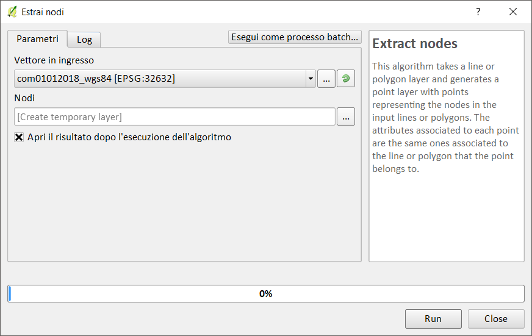
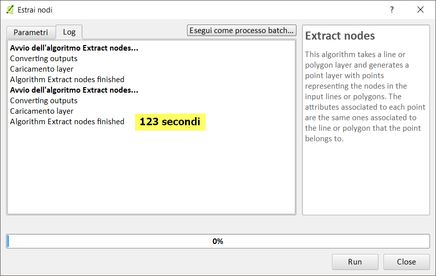

# estrai vertici (LZ50)

dataset: db sqlite con spatialidex

## QGIS 2.18.24






## QGIS 3.2.3


## QGIS 3.3 master


## SpatiaLite_GUI 2.10

estraggo i vertici:


```
-- Creo tabella estraendo i vertici
CREATE TABLE "vertici_com" AS
SELECT ST_DissolvePoints(geometry) as geometry from Com01012018_WGS84;
SELECT RecoverGeometryColumn('vertici_com','geometry',32632,'MULTIPOINT','XY');
-- Esplodo i vertici MultiPoint
SELECT ElementaryGeometries( 'vertici_com' ,'geometry' , 'vertici' ,'out_pk' , 'out_multi_id', 1 ) as num, 'vertici' as label;
```


# RISULTATI

tempo [sec]|programma
:---------:|---------
123|QGIS 2.18.24
66|QGIS 3.2.3
95|QGIS 3.3 master con debug
241| SpatiaLite_GUI 2.10 no spatialIndex
