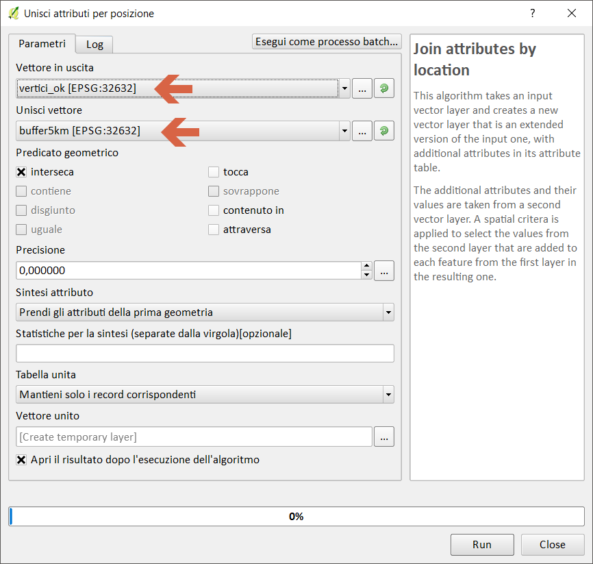
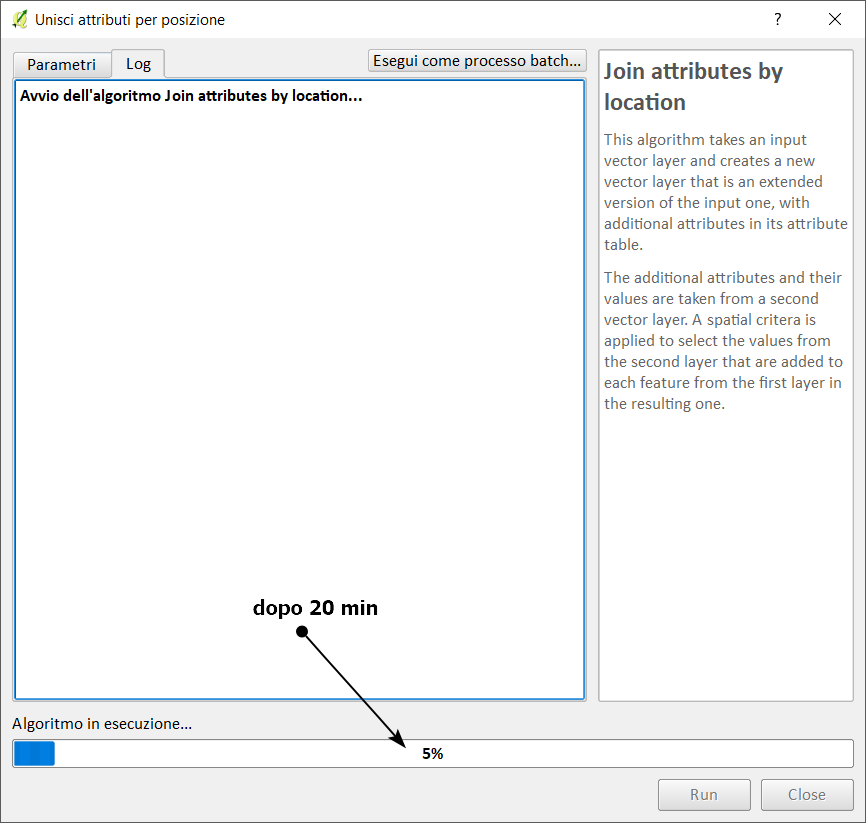
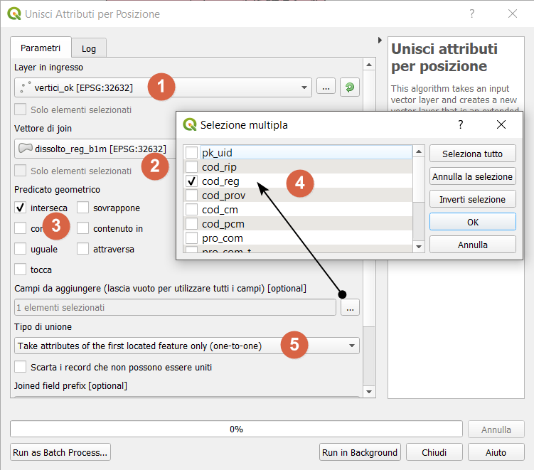
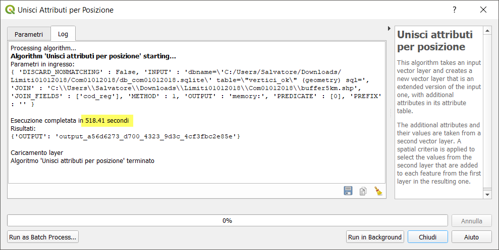
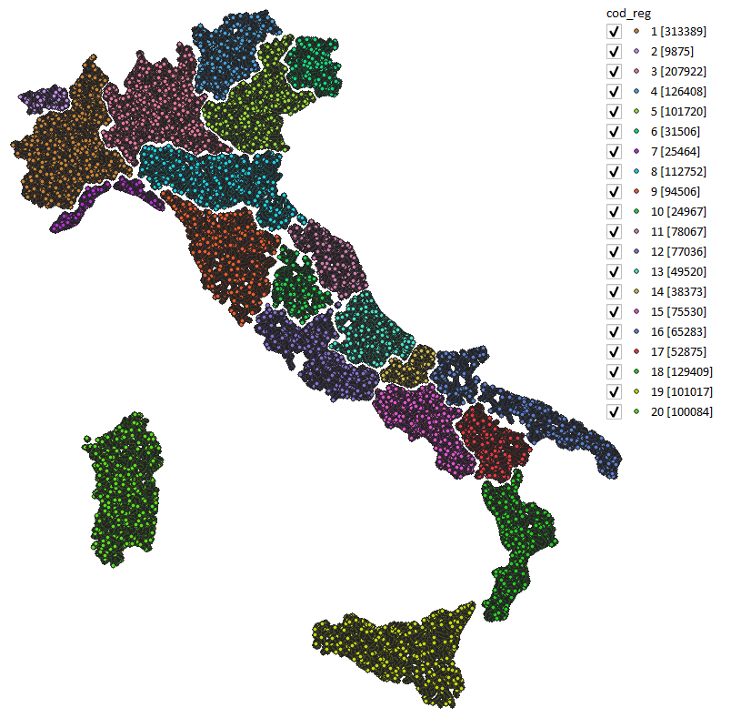
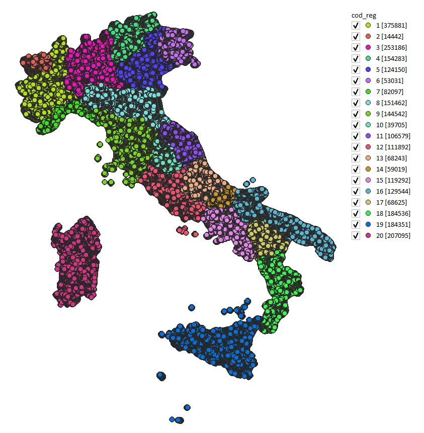
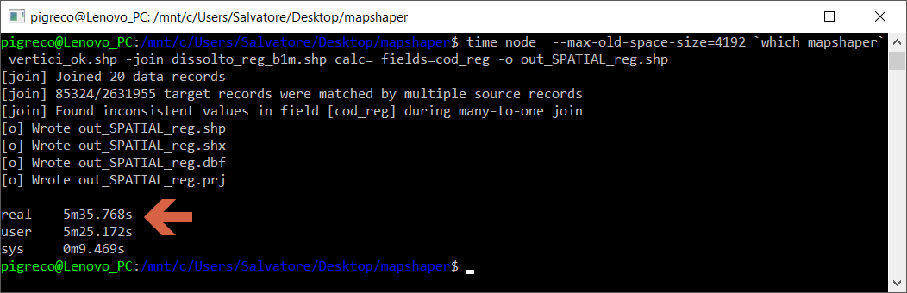

# unisci attributi per posizione (LZ50)

dataset: db sqlite con spatialidex

<!-- TOC -->

- [unisci attributi per posizione (LZ50)](#unisci-attributi-per-posizione-lz50)
    - [QGIS 2.18.24](#qgis-21824)
    - [QGIS 3.2.3](#qgis-323)
    - [QGIS 3.3 master](#qgis-33-master)
    - [SpatiaLite_GUI 2.10](#spatialitegui-210)
    - [PostgreSQL 9.3 / PostGIS 2.2.3 / pgAdmin 3](#postgresql-93--postgis-223--pgadmin-3)
    - [mapshaper](#mapshaper)
    - [R + RStudio](#r--rstudio)
    - [RISULTATI (LZ50) - unisci attributi per posizione](#risultati-lz50---unisci-attributi-per-posizione)

<!-- /TOC -->

## QGIS 2.18.24






## QGIS 3.2.3








## QGIS 3.3 master


NB: Il debug rallenta le prestazioni!!!




## SpatiaLite_GUI 2.10

estraggo i vertici:


```
-- Creo tabella 

```


## PostgreSQL 9.3 / PostGIS 2.2.3 / pgAdmin 3


```
-- crea tabella 

```


## mapshaper

```
time node  --max-old-space-size=4192 `which mapshaper` vertici_ok.shp -join dissolto_reg_b1m.shp calc= fields=cod_reg -o out_SPATIAL_reg.shp
```




## R +  RStudio


## RISULTATI (LZ50) - unisci attributi per posizione

tempo [sec]|software GIS
:---------:|---------
+600|QGIS 2.18.24
565|QGIS 3.2.3
317|QGIS 3.3 master con debug
??|SpatiaLite_GUI 2.10
??|pgAdmin 3 con spatialIndex
335|mapshaper
??|R + RStudio

[torna su](#unisci-attributi-per-posizione-lz50)