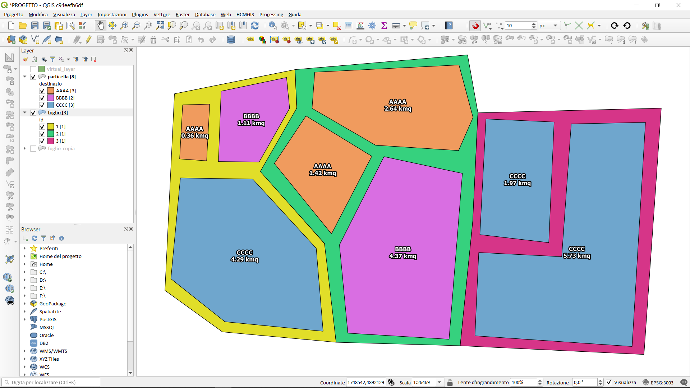
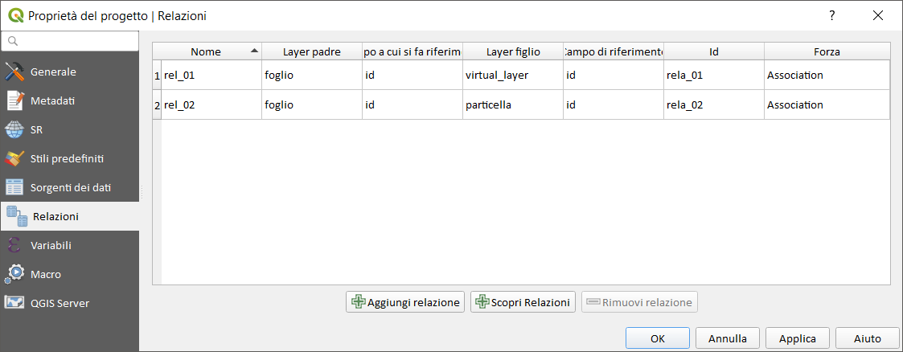
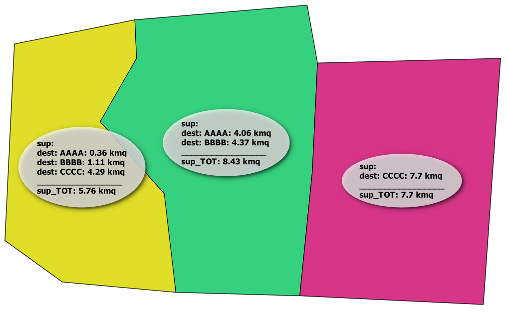
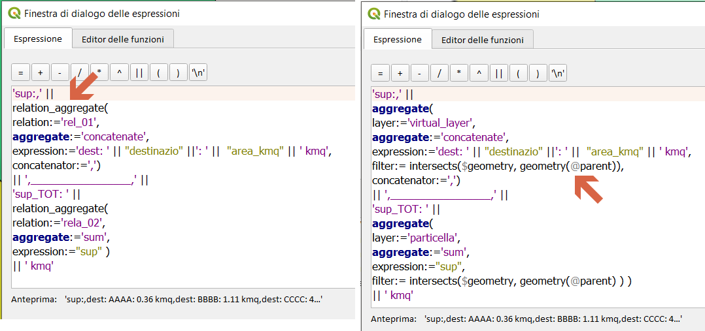

# Funzioni di aggregazione

`relation_agregate` VS variabile `@parent`
--


Due layer: foglio e particelle
---
## Definisco due relazioni di progetto
--

---
espressione utilizzata per l'etichettatura:

```
'sup:,' ||  
relation_aggregate( 
relation:='rel_01', 
aggregate:='concatenate', 
expression:='dest: '||"destinazio"||': '||"area_kmq"||' kmq', 
concatenator:=',') 
|| ',_________________,' || 
'sup_TOT: ' ||  
relation_aggregate( 
relation:='rela_02', 
aggregate:='sum',  
expression:="sup" ) 
|| ' kmq'
```
--
risultato:


---
## Usando SOLO la variabile `@parent`

espressione utilizzata per l'etichettatura:

```
'sup:,' ||  
aggregate( 
layer:='virtual_layer', 
aggregate:='concatenate', 
expression:='dest: '||"destinazio" ||': '||"area_kmq"||' kmq', 
filter:= intersects($geometry, geometry(@parent)),
concatenator:=',') 
|| ',_________________,' || 
'sup_TOT: ' ||  
aggregate( 
layer:='particella', 
aggregate:='sum',  
expression:="sup",
filter:= intersects($geometry, geometry(@parent) ) )
|| ' kmq'
```
--
risultato:


---
Confronto:

