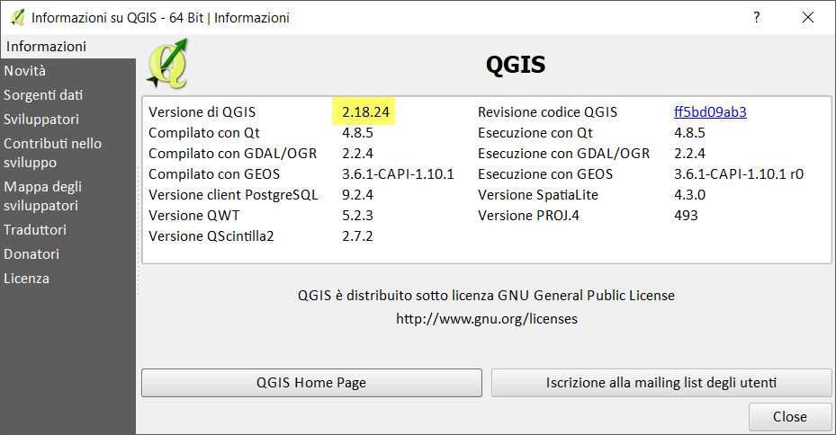
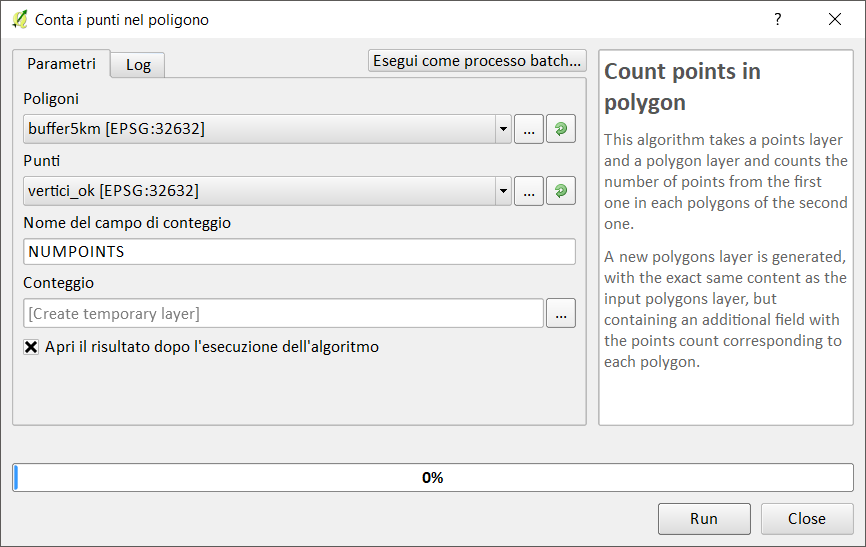
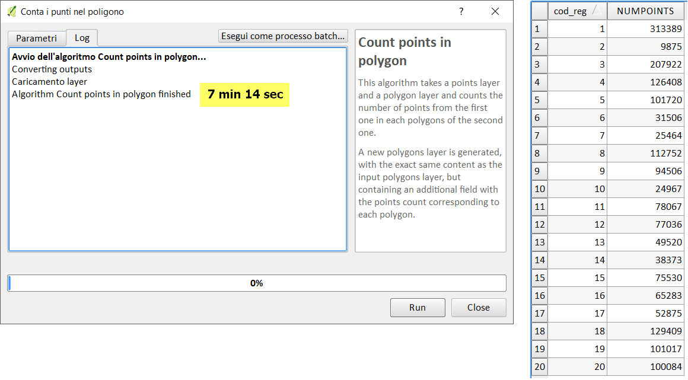
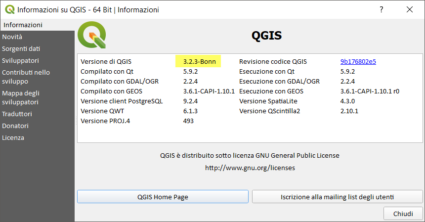
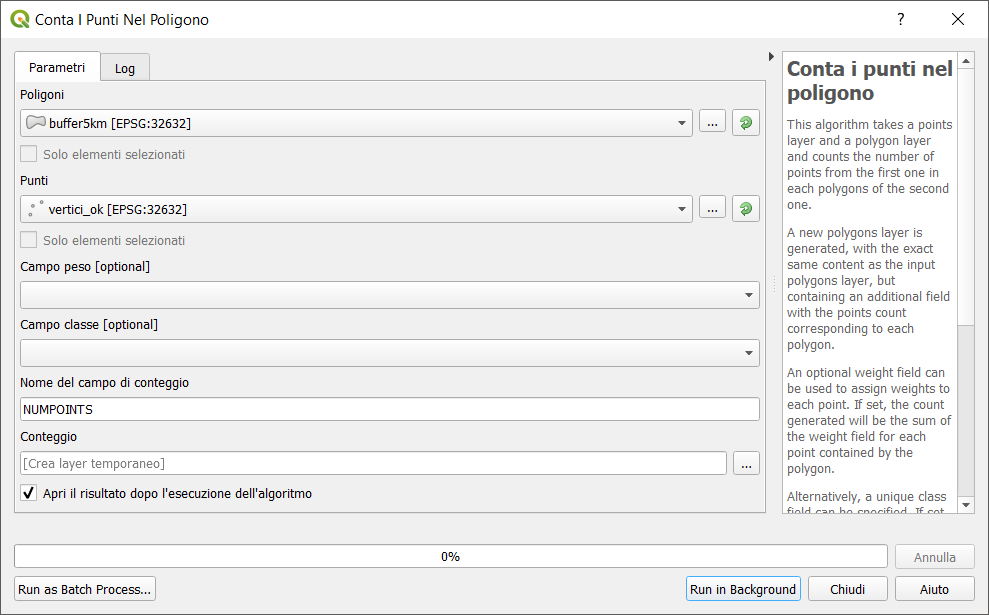
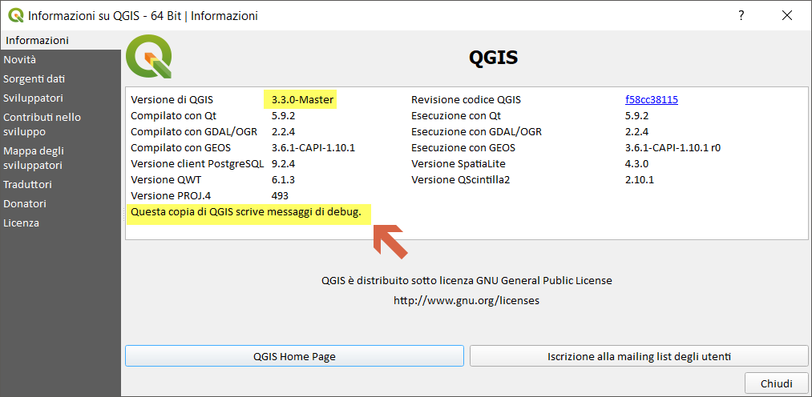
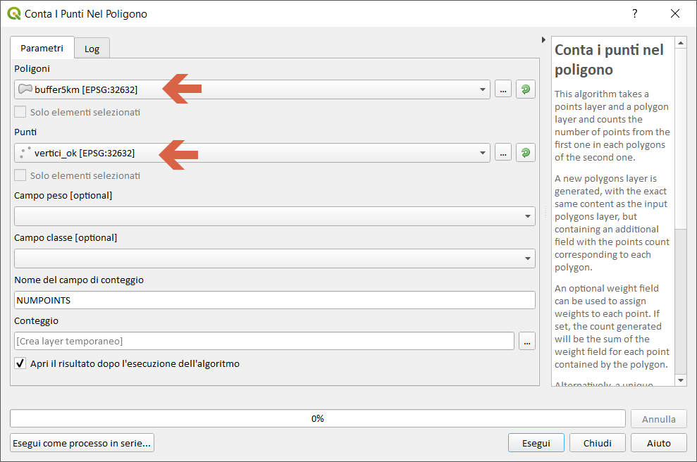

# conta punti nel poligono (LZ50) -RIFARE TUTTO!!!

dataset: db sqlite con spatialindex

<!-- TOC -->

- [conta punti nel poligono (LZ50) -RIFARE TUTTO!!!](#conta-punti-nel-poligono-lz50--rifare-tutto)
    - [QGIS 2.18.24](#qgis-21824)
    - [QGIS 3.2.3](#qgis-323)
    - [QGIS 3.3 master](#qgis-33-master)
    - [SpatiaLite_GUI 2.10](#spatialitegui-210)
    - [PostgreSQL 9.3 / PostGIS 2.2.3 / pgAdmin 3](#postgresql-93--postgis-223--pgadmin-3)
    - [mapshaper](#mapshaper)
    - [R + RStudio](#r--rstudio)
    - [RISULTATI (LZ50) - conta punti nel poligono](#risultati-lz50---conta-punti-nel-poligono)

<!-- /TOC -->

## QGIS 2.18.24







## QGIS 3.2.3






## QGIS 3.3 master



NB: Il debug rallenta le prestazioni!!!




## SpatiaLite_GUI 2.10


Query sfruttando lo SpatialIndex (che corrisponde ai BBOX)

```
SELECT b.cod_reg AS cod_reg, count(*) AS nro
FROM buffer1m b , vertici_ok v 
WHERE v.pk_uid IN (
SELECT rowid FROM SpatialIndex WHERE f_table_name = 'vertici_ok'
AND f_geometry_column = 'geometry' AND search_frame = b.geometry)
GROUP BY 1
```


Con questa query dopo oltre 4 ore:
```
SELECT b.cod_reg AS rowid, count(*) AS nro
FROM buffer1m b, vertex v
WHERE AND v.pk IN (
SELECT rowid FROM SpatialIndex WHERE f_table_name = 'vertex'
AND f_geometry_column = 'geometry' AND search_frame =  b.geometry)
AND St_intersects(b.geometry, v.geometry) = 1
GROUP BY 1
```


## PostgreSQL 9.3 / PostGIS 2.2.3 / pgAdmin 3


**Osservazioni**: PostGIS richiederebbe un tempo incredibilmente lungo per determinare il numero di punti per ogni poligono, la causa è da ricercare nei poligoni delle regioni che hanno migliaia di vertici.

```
SELECT b.cod_reg AS cod_reg, count(v.geom) AS nro
FROM buffer1m b left join vertici_ok v on st_contains(b.geom, v.geom) 
GROUP BY 1
ORDER BY 1
```
oppure
```
SELECT b.cod_reg AS cod_reg,
SUM(CASE WHEN st_contains(b.geom, v.geom) THEN 1 ELSE 0 END) AS nro
FROM buffer1m b , vertici_ok v 
GROUP BY 1
ORDER BY 1
```


dopo 10 minuti... nessun risultato!!!

Usando i BBOX delle regioni:

```
WITH bbox AS (SELECT cod_reg,ST_Envelope(geom) AS geom FROM buffer1m)

SELECT b.cod_reg AS cod_reg, count(v.geom) AS nro
FROM bbox b, vertici_ok v
WHERE st_contains(b.geom, v.geom)
GROUP BY 1
ORDER BY 1
```


L'unica regione che restituisce un valore esatto è la Sardegna!!!

Dopo due ore e questa query:

```
WITH bbox AS (SELECT cod_reg,ST_Envelope(geom) AS geom FROM buffer1m),
     codice as (SELECT b.cod_reg,v.geom FROM bbox b JOIN vertici_ok v ON ST_Intersects(b.geom, v.geom))

SELECT b.cod_reg AS cod_reg, count(v.geom) AS nro
FROM buffer1m b JOIN codice v ON ST_Intersects(b.geom, v.geom)
WHERE b.cod_reg = v.cod_reg
GROUP BY 1
ORDER BY 1;
```


Risultato ESATTO!!! Ma troppo tempo con il mio Laptop!

Utilizzando il vettore regioni ISTAT generalizzato
```
SELECT "COD_REG", count(*)
FROM vertici_ok a JOIN regioni_g b ON St_Intersects(a.geom, b.geom)
GROUP BY 1;
```


## mapshaper

```
time node  --max-old-space-size=4192 `which mapshaper` encoding=utf-8 dissolto_reg_b1m.shp -join vertix.shp calc='join_count = count()' fields= -o out_count_reg.shp
```


## R + RStudio

Osservazione: occorrono circa 7 minuti per caricare i dati in memoria !!!

```
library(rgdal)
library(GISTools)
setwd("C:\\Users\\Salvatore\\Desktop\\mapshaper")
start.time <- Sys.time()
punti<-readOGR("vertici_ok.shp")
reticolo<-readOGR("dissolto_reg_b1m.shp")
end.time <- Sys.time()
time.taken <- end.time - start.time
time.taken
#### calcolo conteggio con misura tempo esecuzione #######
start.time <- Sys.time()
conteggio<-poly.counts(punti, reticolo)
end.time <- Sys.time()
time.taken <- end.time - start.time
time.taken
conteggio
```


PS: non è comprensibile l'output!!!

## RISULTATI (LZ50) - conta punti nel poligono

tempo [sec]|software GIS
:---------:|---------
434|QGIS 2.18.24
488|QGIS 3.2.3
182|QGIS 3.3 master con debug
??|SpatiaLite_GUI 2.10
72478|pgAdmin 3 con spatialIndex
303|mapshaper
420 + 35|R + RStudio

[torna su](#conta-punti-nel-poligono-lz50)